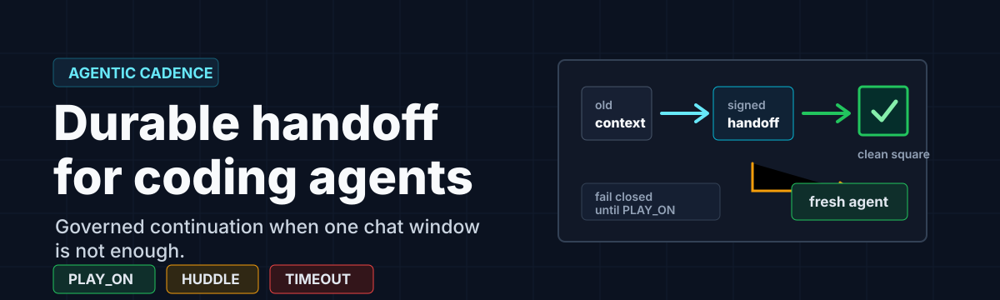
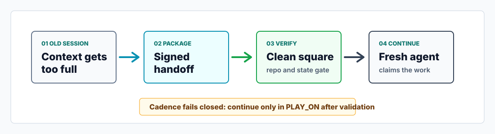
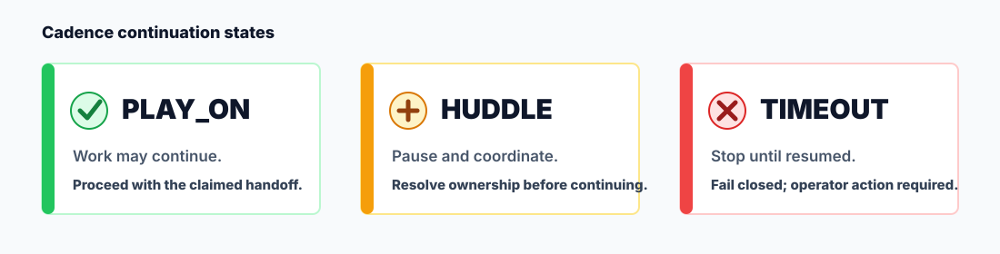

# Agentic Cadence




GitHub-native governance and orchestration for coding agents that must work
without losing the repository's coordination discipline.

Agentic Cadence helps one agent today by stopping cleanly, handing off context
to a fresh session, and continuing only when the repository and Cadence state
allow it. That single-agent workflow remains Phase 1.

The larger product direction is GitHub-native orchestration for autonomous
software teams. Cadence should eventually coordinate multiple bounded agents
through issues, branches, pull requests, reviews, CI, documentation, handoff
contracts, and merge decisions without duplicating work or corrupting
repository state.

The first implementation is used with Codex, and the protocol is intentionally
agent-neutral so future adapters can support Claude, Gemini, and other coding
agents without changing the core governance model.

## Current Status

Agentic Cadence is an early public protocol and tooling release. The released
`0.1.3` baseline is ready for local clone-based use with `pip install .`,
protocol validation, first-run examples, the adapter smoke contract, generic
host-signal and shell host-binding examples, the composite generic adapter
contract runner with reviewer-verifiable compact evidence, release dry-run
verification, and public-release history auditing. The current development tree
additionally includes unreleased read-only audit replay with local hash-chain integrity evidence,
command-policy enforcement, active-stop result-validation controls, and governed
execution-start epoch gating for approved generic executor task packets. It also includes local execution-run evidence records,
local executor epoch closeout, branch-policy-gated dry-run Git/PR planning for
local generic executor task and result evidence, read-only
`github-evidence-sync`, read-only `review-response-plan`, read-only
`post-write-pr-evidence-gate`, read-only `review-thread-resolution-plan`,
read-only `role-readiness`, read-only `executor-invocation-readiness`, read-only `executor-invocation-plan`,
operator-approved `git-pr-dirty-commit-materialize`, operator-approved
`git-pr-materialize`, operator-approved `review-response-materialize`,
read-only `controlled-pr-cycle`, read-only `merge-decision-plan`,
read-only `loop-run-plan`,
read-only `controlled-loop-start`,
read-only `controlled-loop-invocation-plan`,
read-only `controlled-loop-real-invocation`,
read-only `controlled-loop-closeout`,
read-only `controlled-loop-run-summary`,
read-only `controlled-loop-outcome-plan`,
read-only `controlled-loop-run-manifest-plan`,
read-only `controlled-loop-run-manifest-approval`,
read-only `controlled-loop-runner-plan`,
read-only `controlled-loop-runner-execution-approval`,
read-only `controlled-loop-runner-dry-run`,
read-only `controlled-loop-runner-start-readiness`,
read-only `controlled-loop-runner-start-approval`,
controlled `controlled-loop-runner-start`,
read-only `controlled-loop-runner-next-stage`,
read-only `controlled-loop-runner-stage-execution-readiness`,
read-only `controlled-loop-runner-stage-execution-approval`,
read-only `controlled-loop-runner-stage-invocation-boundary`,
controlled `controlled-loop-runner-stage-execute`,
read-only `controlled-loop-runner-stage-closeout`,
read-only `controlled-loop-runner-stage-outcome-plan`,
read-only `controlled-loop-runner-next-stage-continuation`,
reusable `verify-operator-approval`,
read-only `verify-resume`, ownership-aware read-only `resume-continuation`,
local `work-ownership-status` / `validate-work-ownership` /
`claim-work-ownership` / `close-work-ownership` / `fail-work-ownership`, a
fixture-only controlled executor runner for tests and examples, controlled
`invoke-real-executor` process-start evidence, and real-invocation closeout binding
through `closeout-executor-result --real-invocation-file`, plus
`controlled-loop-tick` evidence that composes an already-recorded local
single-tick chain and `controlled-pr-cycle` evidence that composes already
recorded PR/review/post-write packets, plus `merge-decision-plan` evidence
that separates merge readiness from merge authority without retrying the
executor or writing Git/GitHub state, `loop-run-plan` evidence that plans
the next bounded loop steps without starting a runner, and
`controlled-loop-start` evidence that composes a saved loop plan with approved
execution-start evidence without starting a runner or executor, and
`controlled-loop-invocation-plan` evidence that composes the controlled start,
executor-invocation readiness, and invocation plan before any process start,
and `controlled-loop-real-invocation` evidence that composes the saved
controlled invocation plan with the recorded real executor invocation before
closeout, and `controlled-loop-closeout` evidence that composes the saved
controlled real-invocation packet with accepted executor closeout before the
aggregate tick, and `controlled-loop-run-summary` evidence that summarizes the
saved runner-adjacent controlled packet chain without continuing the loop, and
`controlled-loop-outcome-plan` evidence that turns completed terminal
controlled run evidence into the next bounded operator action without starting
a continuation or writing Git/GitHub state, and
`controlled-loop-run-manifest-plan` evidence that binds the saved one-cycle
controlled run evidence files and command stages without appending audit
evidence, starting a runner or executor, retrying executors, continuing the
loop, writing Git/GitHub state, merging, releasing, publishing packages,
assigning roles, or scheduling agents, and
`controlled-loop-run-manifest-approval` evidence that verifies a
target-checksum-bound operator approval for that manifest without granting
runner, executor, continuation, Git/GitHub, merge, release, publication, role,
or scheduling authority, and `controlled-loop-runner-plan` evidence that
turns the approved manifest into a dry-run runner plan without starting a
runner or granting execution authority, and
`controlled-loop-runner-execution-approval` evidence that verifies
target-checksum-bound operator approval for that runner plan without starting a
runner or granting runner-start authority, and
`controlled-loop-runner-dry-run` evidence that rechecks the approved runner
plan and execution approval before emitting would-process stage evidence
without starting a runner or executor, and
`controlled-loop-runner-start-readiness` evidence that validates the completed
dry run before any future runner start while still granting no runner-start
authority, and `controlled-loop-runner-start-approval` evidence that verifies
target-checksum-bound operator approval for that readiness packet without
starting the runner, and `controlled-loop-runner-start` evidence that records
the approved one-cycle runner-start boundary while still not invoking an
executor, continuing the loop, writing Git/GitHub state, merging, releasing,
publishing packages, assigning roles, or scheduling agents, and
`controlled-loop-runner-next-stage` evidence that rechecks the recorded start,
runner-plan, and dry-run packets before selecting the first runner command
stage without executing it, and
`controlled-loop-runner-stage-execution-readiness` evidence that rechecks the
selected stage and upstream runner chain before preparing a deterministic
stage-execution approval target without executing the stage, and
`controlled-loop-runner-stage-execution-approval` evidence that verifies a
target-bound operator approval for that readiness target without starting the
stage or invoking an executor, and
`controlled-loop-runner-stage-invocation-boundary` evidence that re-verifies
the approved selected stage and prepares the exact argv, working-directory
policy, evidence-output policy, timeout policy, and boundary checksum without
starting a process, and `controlled-loop-runner-stage-execute` evidence that
rechecks the boundary and upstream runner chain, executes exactly the approved
stage argv once with `shell=False`, captures stdout/stderr/exit status/output
evidence, appends one execution audit record after process start, and still
does not invoke an executor, retry, execute a second stage, continue the loop,
or write Git/GitHub state, and
`controlled-loop-runner-stage-closeout` evidence that rechecks the saved
execution, invocation-boundary, approval, readiness, and upstream runner
packets, binds the approved output file to captured stdout, classifies the
stage as completed, failed, or blocked, and appends no audit evidence while
still not selecting another stage, retrying, continuing, invoking an executor,
or writing Git/GitHub state, and
`controlled-loop-runner-stage-outcome-plan` evidence that rechecks that
closeout and upstream runner chain before emitting only the next operator
target for continuation selection, completion, or inspection/retry planning
without selecting a stage, retrying, continuing, appending audit, or writing
Git/GitHub state, and
`controlled-loop-runner-next-stage-continuation` evidence that rechecks the
reviewed outcome target plus closeout, execution, runner-start, runner-plan,
and dry-run evidence before selecting exactly the next runner-plan stage
without emitting readiness, executing, retrying, continuing, appending audit,
or writing Git/GitHub state.

The public package identity is `agentic-cadence`. The legacy `codex-cadence` and `codex-transmission` command names remain compatibility aliases, while Claude and Gemini remain future adapter directions rather than shipped support or package metadata keywords.

PyPI publication is not part of this baseline. Treat package-index publication, signed version tags, and broader adapter support as follow-on release work.

See the current [technical roadmap](docs/roadmap.md) for known edges and target
state. See [agent-team orchestration](docs/agent-team-orchestration.md) for the
expanded product vision.

## Vision

Agentic Cadence is a governance and orchestration layer for autonomous software
teams. It can start with one agent, but its primitives should scale toward an
agent pool with clear roles: planning, architecture, building, review, QA,
documentation, release, and handoff.

The system should preserve the same coordination rules disciplined human teams
use on GitHub:

- no direct edits to `main`;
- issue, task, or decision-backed work;
- branch isolation for implementation;
- pull requests for meaningful changes;
- validation before merge;
- review separation when possible;
- explicit context handoff;
- living documentation that changes with the repo;
- small bounded slices instead of ambiguous work;
- orchestrator decisions to continue, stop, retry, split, review, or hand off.

## Future Agent Adapters

The protocol is meant to stay agent-neutral while adapters handle host-specific details. See `docs/adapters.md` for the adapter boundary, current Codex compatibility surface, and the intended path for future Claude and Gemini support.

The adapter smoke contract is executable from a clone:

```bash
python examples/adapter-smoke/run.py --cadence-python python
```

It proves the adapter path through CLI JSON packets without importing Cadence internals. Current packets may still contain Codex-compatible packet labels retained by the 0.1.x command surface; adapters should preserve those packets rather than rewriting them.

The generic host-signal smoke example exercises the adapter-local signal
fixtures before a real host binding exists. Its parity contract compares that
fixture behavior with the generic shell host-binding replay contract:

```bash
python examples/adapter-template/host_signal_contract.py
python examples/generic-host-signal/run.py --cadence-python python
python examples/generic-host-signal/run.py --parity-contract --cadence-python python
```

It verifies no-signal, `context_pressure`, `reviewer_loop`, `ci_loop`, and
`operator_stop` behavior through the copyable adapter template without claiming
Claude or Gemini adapter support.
The schema contract validates that the checked-in host-signal fixtures and
shell host-event payloads have the expected fields and normalized meanings.
The parity contract verifies that the shell host-event mapping stays aligned
with the adapter-template host-signal fixtures for normalized
adapter/CLI-observed behavior.

The generic shell host-binding example adds file-backed and stdin-backed shell
integration paths for one external host event, plus a replay contract that
compares those paths against the bundled fixtures:

```bash
python examples/generic-shell-host-binding/run.py --cadence-python python --host-event-file /path/to/host-event.json
some-host-signal-command | python examples/generic-shell-host-binding/run.py --cadence-python python --host-event-stdin
python examples/generic-shell-host-binding/run.py --replay-contract --cadence-python python
```

The file or stdin payload must contain a `context_pressure`, `reviewer_loop`,
`ci_loop`, or `operator_stop` host-event object, or JSON `null` when no handoff
is needed. This still exercises the adapter template and public CLI boundary;
it does not ship a real Claude or Gemini adapter. The replay contract verifies
that the same payload produces the same normalized adapter/CLI-observed
behavior through bundled fixture, file-backed, and stdin-backed paths.

The generic external host-binding conformance harness compares a supplied
binding command against the same generic shell replay baseline before any named
host adapter is claimed:

```bash
python examples/external-host-binding-conformance/run.py --cadence-python python
```

By default it uses the generic shell host-binding example as the sample external
command. Future host bindings can pass `--binding-command-template` with
quoted path placeholders such as `"{host_event_file}"` and
`"{case_work_dir}"` to prove they match the generic fixture behavior without
claiming Claude or Gemini adapter support.

The generic adapter contract pre-claim suite composes the schema, smoke,
replay, parity, and external conformance contracts into one command:

```bash
python examples/adapter-contract-runner/run.py --cadence-python python
```

On Windows, the runner uses a short per-checkout disposable directory under the
system temp root by default to avoid nested Git path-length failures. Pass
`--work-dir` if you need to choose a specific disposable work directory.

Use it before any future host-specific binding claim. For PR evidence, add the
compact evidence summary:

```bash
python examples/adapter-contract-runner/run.py --cadence-python python --evidence-summary
```

Future bindings can pass the same quoted binding command template through the
runner, with or without `--evidence-summary`, and the runner still reports that
it does not ship Claude or Gemini adapter support.

PR checks upload the compact JSON as the `generic-adapter-contract-evidence`
artifact containing `adapter-contract-evidence.json`, so reviewers can inspect
the generic contract coverage without expanding nested packet payloads in logs.
That compact artifact includes
`schema_version: "generic-adapter-contract-evidence.v1"` so reviewer tooling can
rely on a named evidence shape. The checked-in project-specific schema fixture
also pins the accepted top-level result, compact evidence mode, required
contract labels, observed-label parity, and required pass booleans. It lives at
`examples/adapter-contract-runner/generic-adapter-contract-evidence.v1.schema.json`.
After downloading the artifact file, reviewers can validate that compact shape
without rerunning the suite:

```bash
python examples/adapter-contract-runner/run.py --validate-evidence-file adapter-contract-evidence.json
```

The adapter claim verifier codifies the evidence-only part of the named-host
claim checklist. With no host name it reports that the uploaded generic baseline
must remain generic:

```bash
python examples/adapter-claim-verifier/run.py --evidence-file adapter-contract-evidence.json
```

Before documenting a named non-Codex host binding, run it against compact
evidence emitted from the proposed binding command template:

```bash
python examples/adapter-claim-verifier/run.py --evidence-file adapter-contract-evidence.json --claim-host ExampleHost --binding-command-template 'python path/to/external-binding.py --host-event-file "{host_event_file}" --work-dir "{case_work_dir}" {cadence_args}'
```

It only checks the compact evidence boundary. A named adapter PR still needs the
mapping evidence, implementation files, and docs required by the checklist.

Before documenting a named non-Codex host binding, follow
`docs/adapter-claim-checklist.md` and include the required generic contract
evidence in the PR.

## Protocol At A Glance



## Requirements

- Python 3.11 or newer
- Git

## Install From A Clone

```bash
python -m pip install .
agentic-cadence --help
python -m codex_cadence --help
```

Compatibility command names are still available:

```bash
codex-cadence --help
codex-transmission --help
```

## Five-Minute First Run

Use a disposable runtime root so the first run does not touch your global agent state:

```bash
agentic-cadence --root .agentic-cadence-demo status
agentic-cadence --root .agentic-cadence-demo create-handoff --id read-the-repo --title "Read the repo" --repo local/example --branch main --task-type discovery --message-file examples/first-run/handoff.md
agentic-cadence --root .agentic-cadence-demo next-handoff
agentic-cadence --root .agentic-cadence-demo claim-handoff read-the-repo --claimer demo
agentic-cadence --root .agentic-cadence-demo complete-handoff read-the-repo --summary "first run completed"
```

`.agentic-cadence-demo/` is disposable and ignored by git. The legacy `.codex-cadence-demo/` path is also ignored for compatibility.

## Run The Example Workflow

On macOS or Linux:

```bash
bash examples/first-run/run.sh
```

On Windows PowerShell:

```powershell
powershell -ExecutionPolicy Bypass -File examples/first-run/run.ps1
```

The example creates `examples/first-run/work/`, initializes a tiny target Git repository, runs a handoff lifecycle, and runs candidate discovery against `examples/first-run/work/repo`.

## Candidate Discovery

Candidate discovery is read-only. It can inspect local repo state and reviewed business memory from `docs/cadence/business-memory.md`. The example runner creates `examples/first-run/work/repo` and runs discovery automatically. After running the example workflow, you can repeat that discovery command:

```bash
agentic-cadence --root examples/first-run/work/runtime discover-candidates --cwd examples/first-run/work/repo --intent hybrid --discovery-mode local --elect
```

Business-memory candidates are discovery-only. They can seed investigation, but they cannot directly execute changes, commit, push, merge, or bypass Cadence governance.

## Loop Tick

`loop-tick` runs one read-only Phase 1 loop-controller tick. It snapshots local repo state, discovers and elects candidate work, checks Cadence state, and emits a structured next-action packet.

```bash
agentic-cadence --root examples/first-run/work/runtime loop-tick --cwd examples/first-run/work/repo --repo local/demo --intent repo_health
```

The command does not start an executor, start or complete an epoch, create a branch, commit, push, open a PR, spend review, or merge. Without executor-task emission, it stops with `recommended_next_action` set to `blocked`, `no_candidates`, `approval_required`, or `requires_executor_contract`.

When an elected task exists, `--emit-executor-task` can attach a generic executor task packet for operator approval. The packet includes repo identity, an absolute repo path, allowed paths, command policy, branch policy, required checks, stop conditions, limits, and the expected result-evidence path. Cadence validates the embedded local snapshot as a trust anchor before accepting the packet, but it still does not run the executor:

```bash
agentic-cadence --root examples/first-run/work/runtime loop-tick --cwd examples/first-run/work/repo --repo local/demo --intent repo_health --emit-executor-task --allowed-path . --required-check "python -m unittest discover -s tests" > loop-tick.json
python -c "import json; print(json.dumps(json.load(open('loop-tick.json'))['executor_task'], indent=2))" > executor-task.json
```

The task packet is nested under `executor_task` in the `loop-tick` packet. It must be saved before validating returned executor evidence.

`loop-run-plan` wraps the same read-only loop-tick decision into a
`loop-run-plan.v1` packet that lists the next bounded operator/orchestrator
steps. It can include the emitted executor task checksum and the exact approval
target checksum for later operator approval, but it does not emit the
write-side approval token, continue the loop, start a runner, start an
executor, start an epoch, create a branch, commit, push, open or update a PR,
call GitHub, merge, release, publish packages, assign roles, or schedule
agents:

```bash
agentic-cadence --root examples/first-run/work/runtime loop-run-plan --cwd examples/first-run/work/repo --repo local/demo --intent repo_health --emit-executor-task --allowed-path . --required-check "python -m unittest discover -s tests"
```

`controlled-loop-start` composes a saved `loop-run-plan.v1` packet with a
separately produced `execution-start.v1` packet after the operator-approved
execution-start gate has already run. It rechecks the planned executor task
checksum against the execution-start task anchor plus the local active epoch and
start audit record before reporting the next bounded recommendation, but it
still does not continue the loop, start a runner, start or retry an executor,
call GitHub, create branches, commit, push, open PRs, merge, release, publish
packages, assign roles, or schedule agents:

```bash
agentic-cadence --root examples/first-run/work/runtime controlled-loop-start --loop-run-plan-file loop-run-plan.json --execution-start-file execution-start.json
```

`controlled-loop-invocation-plan` composes a saved
`controlled-loop-start.v1` packet with saved `executor-invocation-readiness.v1`
and `executor-invocation-plan.v1` packets. It rechecks the controlled start's
task and epoch anchors against readiness, rechecks the invocation plan's
readiness and target checksums, and then recommends `invoke_real_executor`
without starting the executor, continuing the loop, or writing Git/GitHub
state:

```bash
agentic-cadence --root examples/first-run/work/runtime controlled-loop-invocation-plan --controlled-loop-start-file controlled-loop-start.json --readiness-file executor-invocation-readiness.json --invocation-plan-file executor-invocation-plan.json
```

`controlled-loop-real-invocation` composes a saved
`controlled-loop-invocation-plan.v1` packet with a saved
`real-executor-invocation.v1` record after `invoke-real-executor` has already
run. It rechecks the embedded invocation plan checksum, target checksum,
plan-file anchor, invocation record-file anchor, result-file path and checksum,
invocation audit record, invocation id, and pending closeout status before recommending
`closeout_executor_result`, without starting or retrying the executor,
continuing the loop, appending audit, or writing Git/GitHub state:

```bash
agentic-cadence --root examples/first-run/work/runtime controlled-loop-real-invocation --controlled-invocation-plan-file controlled-loop-invocation-plan.json --real-invocation-file real-executor-invocation.json
```

`controlled-loop-closeout` composes a saved
`controlled-loop-real-invocation.v1` packet with a saved
`executor-epoch-closeout.v1` packet after closeout has already run. It rechecks
the pre-closeout invocation checksum, the terminal closeout status, the updated
real-invocation record checksum, the closeout and real-invocation audit
anchors, and the epoch closeout checksum before recommending
`controlled_loop_tick`, without closing epochs, rewriting invocation records,
continuing the loop, appending audit, or writing Git/GitHub state:

```bash
agentic-cadence --root examples/first-run/work/runtime controlled-loop-closeout --controlled-real-invocation-file controlled-loop-real-invocation.json --closeout-file executor-closeout.json
```

`start-governed-execution` is the local write-side gate that consumes a reviewed
`generic-executor-task.v1` packet and starts exactly one active epoch when the
task packet shape, task-carried command and branch policy fields, current repo
path, branch, `HEAD`, clean worktree, operator approval, brake, active-epoch
state, and any supplied local work-ownership evidence still match. The approval
token is the exact checksum token for the reviewed task packet:
`approve-executor-task:<task-packet-checksum>`.

```bash
agentic-cadence --root examples/first-run/work/runtime start-governed-execution --task-file executor-task.json --approval-token approve-executor-task:<task-packet-checksum>
agentic-cadence --root examples/first-run/work/runtime start-governed-execution --task-file executor-task.json --approval-token approve-executor-task:<task-packet-checksum> --ownership-target ownership-1 --ownership-role implementer --ownership-claimer local-agent
```

The command emits an `execution-start.v1` packet with `read_only: false`,
`epoch_started`, `executor_started: false`, `blockers`, and
`recommended_next_action`. When `--ownership-target` is supplied, it rechecks
the active `work-ownership.v1` record for task id, candidate id, role, claimer,
repo, branch, `HEAD`, duplicate active ownership, freshness, malformed
evidence, and registry path safety before epoch mutation. A valid ownership
start binds the started epoch id back to the active ownership record and emits
`work_ownership_epoch_bound`; if audit append fails after binding, it restores
both the active epoch and the ownership record and emits
`work_ownership_epoch_binding_rollback`. Stable blocker codes include
`task_file_unreadable`, `executor_task_invalid`, `operator_approval_missing`,
`operator_approval_mismatch`, `repo_path_mismatch`,
`repo_inspection_failed`, `repo_branch_mismatch`, `repo_head_mismatch`,
`dirty_worktree`, `repo_confidence_low`, `brake_state_invalid`,
`brake_not_drive`, `active_epoch_exists`, `active_epoch_invalid`,
`epoch_start_failed`, `audit_append_failed`, `epoch_rollback_failed`,
`ownership_record_missing`, `duplicate_active_ownership`, `ownership_stale`,
`ownership_record_invalid`, `ownership_repo_mismatch`,
`ownership_branch_mismatch`, `ownership_task_mismatch`,
`ownership_candidate_mismatch`, `ownership_role_mismatch`,
`ownership_claimer_mismatch`, `ownership_head_mismatch`,
`ownership_record_write_failed`, and `ownership_rollback_failed`.
Successful starts append an `execution_start_decision` audit record, including
`ownership_id` and `ownership_record_checksum` when ownership was supplied, but
the command does not invoke an executor, edit code, create branches, write pull
requests, merge, release, or publish packages.

`verify-operator-approval` verifies reusable `operator-approval.v1` identity
evidence for a target checksum and purpose before later gates consume it. The
packet includes `target_checksum`, `purpose`, `operator_id`, `key_id`,
`issued_at`, `expires_at`, and an `hmac-sha256:` signature over the approval
fields. By default the verifier reads its local HMAC secret from
`CADENCE_OPERATOR_APPROVAL_SECRET`; `--approval-secret` exists for explicit
local checks and tests. Accepted verification emits
`operator-approval-verification.v1` and appends an
`operator_approval_verification` audit record, but it does not start epochs,
invoke executors, create branches, push, open PRs, merge, release, or publish
packages:

```bash
agentic-cadence --root examples/first-run/work/runtime verify-operator-approval --approval-file operator-approval.json --target-checksum sha256:<target-packet-checksum> --purpose start_governed_execution --approval-secret-env CADENCE_OPERATOR_APPROVAL_SECRET
```

Stable blocker codes include `operator_approval_file_unreadable`,
`operator_approval_invalid`, `operator_approval_schema_invalid`,
`operator_approval_target_invalid`, `operator_approval_target_mismatch`,
`operator_approval_purpose_missing`, `operator_approval_purpose_mismatch`,
`operator_approval_operator_missing`, `operator_approval_operator_mismatch`,
`operator_approval_expected_operator_invalid`, `operator_approval_key_id_weak`,
`operator_approval_timestamp_invalid`, `operator_approval_window_too_long`,
`operator_approval_expired`, `operator_approval_issued_in_future`,
`operator_approval_signature_invalid`, `operator_approval_secret_missing`, and
`operator_approval_audit_append_failed`. Approval validity windows must not
exceed 60 minutes.

Executor result evidence can be checked without running an executor:

```bash
agentic-cadence --root examples/first-run/work/runtime validate-executor-result --task-file executor-task.json --result-file executor-result.json
```

After an active epoch exists and a fresh `snapshot-repo` packet has been saved,
`closeout-executor-result` can consume the local task packet, result evidence,
snapshot-after packet, and exactly one evidence artifact (`--run-record-file` or
`--real-invocation-file`). It validates the same
executor evidence gates, rejects supplied run records whose task checksum,
result checksum, validation checksum, repo branch/head anchors, or closeout
status no longer match, records a successful task result while keeping the epoch
active when other epoch tasks remain, completes the epoch only when all recorded
tasks are complete, fails the epoch for valid failed/blocked/stopped evidence or
policy violations, and emits the next local decision:

```bash
agentic-cadence --root examples/first-run/work/runtime closeout-executor-result --epoch-id epoch-123 --task-file executor-task.json --result-file executor-result.json --snapshot-after-file snapshot-after.json --run-record-file execution-run.json --emit-git-pr-plan --cwd examples/first-run/work/repo --required-body-section Summary --required-body-section Validation
```

The optional Git/PR plan is embedded as a dry-run packet only after terminal
epoch completion, and supplied PR-template inputs are validated before terminal
state is mutated. When a supplied run record is accepted and closeout succeeds,
Cadence updates that local `execution-run.v1` record with the closeout status,
epoch id/status, and closeout checksum, then appends an `execution_run_record`
audit event. The closeout command does not start an executor, create a branch,
commit, push, call GitHub, open a pull request, merge, release, or publish
packages.

For tests and examples, `run-controlled-executor-fixture` can launch a fake
external executor component from an explicit command template. The template may
use `{task_file}`, `{result_file}`, and `{repo_path}` placeholders, but it must
invoke the bundled fixture script by absolute path through the current Python interpreter.
Cadence validates the task packet and command policy before starting the
fixture, runs the fixture as an argument vector without shell expansion,
requires the expected result evidence file to stay inside the runtime root and
not already exist, writes a local `execution-run.v1` record under
`<root>/execution-runs/`, records `executor_fixture_invocation`,
`executor_result_validation`, and `execution_run_record` audit records, and
validates timeout or active-brake stop evidence before accepting the result:

```bash
agentic-cadence --root examples/first-run/work/runtime run-controlled-executor-fixture --task-file executor-task.json --command-template "\"/absolute/path/to/current-python\" \"/absolute/path/to/agentic-cadence/examples/controlled-executor-fixture/run.py\" --task-file \"{task_file}\" --result-file \"{result_file}\" --status succeeded --summary \"fixture completed\" --command \"python -m unittest discover -s tests\"" --timeout-seconds 60
```

The returned packet uses `controlled-executor-fixture-run.v1`. This command is
fixture-only. It is not a real executor integration or named host adapter, and
malformed templates fail closed before launch. It must not create branches,
commit, push, open or merge PRs, create releases, or publish packages.

`controlled-loop-tick` composes an existing local evidence chain into one
`controlled-loop-tick.v1` packet after the individual commands have already
run. It reads saved `loop-tick`, `generic-executor-task.v1`,
`execution-start.v1`, `executor-invocation-readiness.v1`,
`executor-invocation-plan.v1`, `real-executor-invocation.v1`,
`generic-executor-result.v1`, snapshot-after, `executor-epoch-closeout.v1`,
and optional `git-pr-plan.v1` files, then rechecks their path and checksum
anchors. A supplied optional Git/PR plan must also be a review-ready dry-run
packet with no side effects or execution authority:

```bash
agentic-cadence --root examples/first-run/work/runtime controlled-loop-tick --loop-tick-file loop-tick.json --task-file executor-task.json --execution-start-file execution-start.json --readiness-file executor-invocation-readiness.json --invocation-plan-file executor-invocation-plan.json --real-invocation-file real-executor-invocation.json --result-file executor-result.json --snapshot-after-file snapshot-after.json --closeout-file executor-closeout.json
```

A valid packet sets `controlled_tick_status: completed`, includes
`generated_at`, appends `controlled_loop_tick` audit evidence, and records
`controlled_loop_tick_audit_appended`. Blocked packets return stable mismatch
codes and append no audit record. The command composes existing local evidence
only and carries limitation tokens including
`composes_existing_local_evidence_only`, `does_not_retry_executor`, and
`does_not_rewrite_invocation_or_closeout_records`. `executor_started` reflects
the accepted prior real-invocation record, not a new process start. It does not
retry the executor, rewrite invocation or closeout records, execute Git
commands, call GitHub, create branches, commit, push, open/update PRs, merge,
release, publish packages, assign roles, schedule agents, or claim distributed
locks. Post-validation audit append failures
return `controlled_loop_tick_audit_append_failed` and recommend
`recover_controlled_tick_audit`.

`controlled-loop-run-summary` composes the saved runner-adjacent controlled
packets into one read-only summary after the aggregate tick already exists. It
reads saved `loop-run-plan.v1`, `controlled-loop-start.v1`,
`controlled-loop-invocation-plan.v1`, `controlled-loop-real-invocation.v1`,
`controlled-loop-closeout.v1`, and `controlled-loop-tick.v1` files, then
rechecks schemas, completed statuses, file anchors, and checksums across the
chain:

```bash
agentic-cadence --root examples/first-run/work/runtime controlled-loop-run-summary --loop-run-plan-file loop-run-plan.json --controlled-loop-start-file controlled-loop-start.json --controlled-invocation-plan-file controlled-loop-invocation-plan.json --controlled-real-invocation-file controlled-loop-real-invocation.json --controlled-closeout-file controlled-loop-closeout.json --controlled-loop-tick-file controlled-loop-tick.json
```

Completed summaries recommend `review_controlled_loop_run`; blocked summaries
recommend `inspect_controlled_loop_run_blockers`. The summary command appends no
audit evidence, starts no runner or executor, retries nothing, continues no
loop, and writes no Git/GitHub state.

`controlled-loop-outcome-plan` composes the saved terminal controlled run
summary, controlled closeout, and controlled tick into a read-only next-action
packet. It rechecks summary/tick/closeout checksums, file anchors, task and
epoch identity, terminal closeout state, and the source next decision/action
before recommending a bounded follow-up:

```bash
agentic-cadence --root examples/first-run/work/runtime controlled-loop-outcome-plan --controlled-run-summary-file controlled-loop-run-summary.json --controlled-closeout-file controlled-loop-closeout.json --controlled-loop-tick-file controlled-loop-tick.json
```

For `generate_git_pr_plan`, it recommends `run_git_pr_plan` when no embedded
plan exists, `request_git_pr_materialization_approval` only when a ready dry-run
plan is embedded and the same plan is anchored by the controlled tick's saved
Git/PR plan file and checksum, or `inspect_git_pr_plan_blockers` when the
embedded or anchored plan is missing, malformed, unready, or mismatched. Git/PR
plan blockers make the outcome packet blocked instead of approval-ready. The
command maps completed `continue`, `handoff`, `stop`, and
`validate_more_evidence` decisions only through its bounded source-action
allowlist. It appends no audit evidence, starts no runner or executor, retries
nothing, continues no loop, and writes no Git/GitHub state.

`controlled-loop-run-manifest-plan` composes the saved controlled run summary,
controlled closeout, controlled tick, and outcome plan into a read-only manifest
packet. It rechecks the outcome-plan file and checksum anchors for the supplied
terminal evidence, then records the evidence files and controlled command-stage
sequence needed to review a future one-cycle runner:

```bash
agentic-cadence --root examples/first-run/work/runtime controlled-loop-run-manifest-plan --controlled-run-summary-file controlled-loop-run-summary.json --controlled-closeout-file controlled-loop-closeout.json --controlled-loop-tick-file controlled-loop-tick.json --controlled-outcome-plan-file controlled-loop-outcome-plan.json
```

Completed manifests recommend `review_controlled_run_manifest`; stale outcome
evidence recommends `refresh_controlled_loop_outcome_plan`. The command appends
no audit evidence and does not start a runner or executor, retry an executor,
continue a loop, start or close an epoch, execute Git commands, call GitHub,
create branches, commit, push, create PRs, merge, release, publish packages,
assign roles, or schedule agents.

`controlled-loop-run-manifest-approval` verifies an operator approval for a
saved controlled run manifest plan. The approval must use purpose
`controlled_loop_run_manifest` and target the exact checksum of the saved
`controlled-loop-run-manifest-plan.v1` packet:

```bash
agentic-cadence --root examples/first-run/work/runtime controlled-loop-run-manifest-approval --controlled-run-manifest-plan-file controlled-loop-run-manifest-plan.json --approval-file operator-approval-controlled-run-manifest.json --approval-secret-env CADENCE_OPERATOR_APPROVAL_SECRET > controlled-loop-run-manifest-approval.json
```

Completed approvals recommend `review_controlled_run_manifest_approval`; stale
manifest evidence recommends `refresh_controlled_run_manifest_plan`; invalid
approval evidence recommends `fix_controlled_run_manifest_approval`. The command
appends no audit evidence and does not start a runner or executor, retry an
executor, continue a loop, start or close an epoch, execute Git commands, call
GitHub, create branches, commit, push, create PRs, merge, release, publish
packages, assign roles, or schedule agents.

`controlled-loop-runner-plan` composes the saved manifest plan and saved
manifest approval evidence into a read-only dry-run runner plan. It recomputes
the manifest and approval checksums, rechecks the approval evidence target,
rereads and rehashes the saved operator approval file, verifies that checksum
against the approval evidence, and re-verifies the operator approval signature
before listing the approved one-cycle command sequence:

```bash
agentic-cadence --root examples/first-run/work/runtime controlled-loop-runner-plan --controlled-run-manifest-plan-file controlled-loop-run-manifest-plan.json --controlled-run-manifest-approval-file controlled-loop-run-manifest-approval.json --approval-secret-env CADENCE_OPERATOR_APPROVAL_SECRET
```

Completed runner plans recommend `review_controlled_runner_plan`; stale
manifest approval evidence recommends `refresh_controlled_run_manifest_approval`.
The command appends no audit evidence and does not start a runner or executor,
retry an executor, continue a loop, start or close an epoch, execute Git
commands, call GitHub, create branches, commit, push, create PRs, merge,
release, publish packages, assign roles, or schedule agents.

`controlled-loop-runner-execution-approval` verifies an operator approval for a
saved controlled runner plan. The approval must use purpose
`controlled_loop_runner_execution` and target the exact checksum of the saved
`controlled-loop-runner-plan.v1` packet:

```bash
agentic-cadence --root examples/first-run/work/runtime controlled-loop-runner-execution-approval --controlled-loop-runner-plan-file controlled-loop-runner-plan.json --approval-file operator-approval-controlled-runner-execution.json --approval-secret-env CADENCE_OPERATOR_APPROVAL_SECRET
```

Completed approvals recommend
`review_controlled_runner_execution_approval`; stale runner-plan evidence
recommends `refresh_controlled_runner_plan`; invalid approval evidence
recommends `fix_controlled_runner_execution_approval`. The command appends no
audit evidence and does not start a runner or executor, retry an executor,
continue a loop, start or close an epoch, execute Git commands, call GitHub,
create branches, commit, push, create PRs, merge, release, publish packages,
assign roles, or schedule agents.

`controlled-loop-runner-dry-run` consumes a saved completed
`controlled-loop-runner-plan.v1` packet and saved completed
`controlled-loop-runner-execution-approval.v1` packet. It recomputes the
runner-plan and approval-evidence checksums, rechecks file anchors, rereads and
re-verifies the saved operator approval file, and emits would-process evidence
for the approved command stages without starting a runner:

```bash
agentic-cadence --root examples/first-run/work/runtime controlled-loop-runner-dry-run --controlled-loop-runner-plan-file controlled-loop-runner-plan.json --controlled-loop-runner-execution-approval-file controlled-loop-runner-execution-approval.json --approval-secret-env CADENCE_OPERATOR_APPROVAL_SECRET
```

Completed dry runs recommend `review_controlled_runner_dry_run` and stop at
`stop_after_controlled_runner_dry_run`. The command appends no audit evidence
and does not start a runner or executor, retry an executor, continue a loop,
start or close an epoch, execute Git commands, call GitHub, create branches,
commit, push, create PRs, merge, release, publish packages, assign roles, or
schedule agents.

`controlled-loop-runner-start-readiness` consumes a saved completed
`controlled-loop-runner-dry-run.v1` packet plus the runner plan and execution
approval files that dry run referenced. It recomputes all three checksums,
revalidates the supplied plan and approval packets, rechecks file anchors,
verifies the dry-run command sequence and stage list still match the approved
runner plan, verifies every dry-run command stage remains `would_process`, and
emits readiness-only evidence for a future runner start:

```bash
agentic-cadence --root examples/first-run/work/runtime controlled-loop-runner-start-readiness --controlled-loop-runner-dry-run-file controlled-loop-runner-dry-run.json --controlled-loop-runner-plan-file controlled-loop-runner-plan.json --controlled-loop-runner-execution-approval-file controlled-loop-runner-execution-approval.json
```

Completed readiness packets recommend
`review_controlled_runner_start_readiness` and stop at
`stop_before_runner_start`. The command appends no audit evidence and does not
start a runner or executor, invoke or retry an executor, continue a loop, start
or close an epoch, execute Git commands, call GitHub, create branches, commit,
push, create PRs, merge, release, publish packages, assign roles, or schedule
agents.

`controlled-loop-runner-start-approval` consumes a saved completed
`controlled-loop-runner-start-readiness.v1` packet plus an
`operator-approval.v1` whose `target_checksum` equals the start-readiness
checksum and whose purpose is `controlled_loop_runner_start`. It revalidates
the readiness packet, verifies the target-bound approval, and emits
approval-only evidence without starting the runner:

```bash
agentic-cadence --root examples/first-run/work/runtime controlled-loop-runner-start-approval --controlled-loop-runner-start-readiness-file controlled-loop-runner-start-readiness.json --approval-file operator-approval-controlled-runner-start.json --approval-secret-env CADENCE_OPERATOR_APPROVAL_SECRET
```

Completed start-approval packets recommend
`review_controlled_runner_start_approval` and stop at
`review_approved_controlled_runner_start`. The command appends no audit
evidence and does not start a runner or executor, invoke or retry an executor,
continue a loop, start or close an epoch, execute Git commands, call GitHub,
create branches, commit, push, create PRs, merge, release, publish packages,
assign roles, or schedule agents.

`controlled-loop-runner-start` consumes a saved completed
`controlled-loop-runner-start-approval.v1` packet plus the saved
start-readiness, dry-run, runner-plan, and execution-approval packets. It
rechecks file anchors, checksums, operator approval identity, readiness stages,
dry-run stages, runner-plan stages, and execution-approval anchors/checksums,
including its operator approval file, before recording the approved one-cycle
runner-start boundary:

```bash
agentic-cadence --root examples/first-run/work/runtime controlled-loop-runner-start --controlled-loop-runner-start-approval-file controlled-loop-runner-start-approval.json --controlled-loop-runner-start-readiness-file controlled-loop-runner-start-readiness.json --controlled-loop-runner-dry-run-file controlled-loop-runner-dry-run.json --controlled-loop-runner-plan-file controlled-loop-runner-plan.json --controlled-loop-runner-execution-approval-file controlled-loop-runner-execution-approval.json --approval-secret-env CADENCE_OPERATOR_APPROVAL_SECRET
```

Completed start packets recommend `review_controlled_runner_start`, append one
`controlled_loop_runner_start` audit record, and stop at
`stop_after_controlled_runner_start`. The command starts no executor, invokes
or retries no executor, continues no loop, starts or closes no epoch, executes
no Git commands, calls no GitHub APIs, creates no branches, commits, pushes,
opens no PRs, merges no PRs, releases no artifacts, publishes no packages,
assigns no roles, and schedules no agents.

`controlled-loop-runner-next-stage` consumes saved completed
`controlled-loop-runner-start.v1`, `controlled-loop-runner-plan.v1`, and
`controlled-loop-runner-dry-run.v1` packets. It rechecks anchors, checksums,
and stage sequences, then selects the first controlled runner stage without
executing it:

```bash
agentic-cadence --root examples/first-run/work/runtime controlled-loop-runner-next-stage --controlled-loop-runner-start-file controlled-loop-runner-start.json --controlled-loop-runner-plan-file controlled-loop-runner-plan.json --controlled-loop-runner-dry-run-file controlled-loop-runner-dry-run.json --stage-number 1
```

Completed next-stage packets recommend `review_controlled_runner_next_stage`,
select `loop-run-plan` with `stage_status: selected_not_executed`, report
`stage_execution_started: false`, and append no audit evidence.

`controlled-loop-runner-stage-execution-readiness` consumes saved completed
`controlled-loop-runner-next-stage.v1`, `controlled-loop-runner-start.v1`,
`controlled-loop-runner-plan.v1`, and `controlled-loop-runner-dry-run.v1`
packets. It rechecks the selected stage, anchors, checksums, and dry-run stage
sequence, then prepares a stage-execution approval target without executing the
stage:

```bash
agentic-cadence --root examples/first-run/work/runtime controlled-loop-runner-stage-execution-readiness --controlled-loop-runner-next-stage-file controlled-loop-runner-next-stage.json --controlled-loop-runner-start-file controlled-loop-runner-start.json --controlled-loop-runner-plan-file controlled-loop-runner-plan.json --controlled-loop-runner-dry-run-file controlled-loop-runner-dry-run.json --stage-number 1
```

Completed readiness packets recommend
`review_controlled_runner_stage_execution_readiness`, set
`next_controlled_action: approve_controlled_runner_stage_execution`, include a
deterministic `stage_execution_approval_target_checksum` that binds the
readiness timestamp, selected stage, and upstream runner checksums, and append
no audit evidence.

`controlled-loop-runner-stage-execution-approval` consumes saved completed
`controlled-loop-runner-stage-execution-readiness.v1`,
`controlled-loop-runner-next-stage.v1`, `controlled-loop-runner-start.v1`,
`controlled-loop-runner-plan.v1`, `controlled-loop-runner-dry-run.v1`, and a
target-bound `operator-approval.v1` packet. It rechecks the full upstream
runner chain, verifies the approval signature with the local approval secret,
requires purpose `controlled_loop_runner_stage_execution`, requires
`--expected-operator-id` to match the signed approval operator, and requires
the approval target checksum to match the readiness packet's
`stage_execution_approval_target_checksum`:

```bash
agentic-cadence --root examples/first-run/work/runtime controlled-loop-runner-stage-execution-approval --controlled-loop-runner-stage-execution-readiness-file controlled-loop-runner-stage-execution-readiness.json --controlled-loop-runner-next-stage-file controlled-loop-runner-next-stage.json --controlled-loop-runner-start-file controlled-loop-runner-start.json --controlled-loop-runner-plan-file controlled-loop-runner-plan.json --controlled-loop-runner-dry-run-file controlled-loop-runner-dry-run.json --approval-file operator-approval-controlled-runner-stage-execution.json --expected-operator-id operator@example.test --approval-secret-env CADENCE_OPERATOR_APPROVAL_SECRET
```

Completed approval packets recommend
`review_controlled_runner_stage_execution_approval`, set
`next_controlled_action: prepare_controlled_runner_stage_invocation_boundary`,
preserve approval identity/signature evidence plus the expected operator
binding, and append no audit evidence. They do not start a runner stage,
invoke or retry an executor, continue the loop, or write Git/GitHub state.

`controlled-loop-runner-stage-invocation-boundary` consumes saved completed
`controlled-loop-runner-stage-execution-approval.v1`,
`controlled-loop-runner-stage-execution-readiness.v1`,
`controlled-loop-runner-next-stage.v1`, `controlled-loop-runner-start.v1`,
`controlled-loop-runner-plan.v1`, and `controlled-loop-runner-dry-run.v1`
packets. It rechecks the full runner chain, re-verifies the saved operator
approval with the local approval secret, and confirms the approved selected
stage before emitting the exact stage invocation boundary without starting a
process:

```bash
agentic-cadence --root examples/first-run/work/runtime controlled-loop-runner-stage-invocation-boundary --controlled-loop-runner-stage-execution-approval-file controlled-loop-runner-stage-execution-approval.json --controlled-loop-runner-stage-execution-readiness-file controlled-loop-runner-stage-execution-readiness.json --controlled-loop-runner-next-stage-file controlled-loop-runner-next-stage.json --controlled-loop-runner-start-file controlled-loop-runner-start.json --controlled-loop-runner-plan-file controlled-loop-runner-plan.json --controlled-loop-runner-dry-run-file controlled-loop-runner-dry-run.json --stage-cwd examples/first-run/work/repo --stage-output-file controlled-loop-runner-stage-output.json --stage-timeout-seconds 300 --expected-operator-id operator@example.test --approval-secret-env CADENCE_OPERATOR_APPROVAL_SECRET --stage-number 1
```

Completed boundary packets recommend
`review_controlled_runner_stage_invocation_boundary`, set
`next_controlled_action: execute_approved_runner_stage_once`, include the
exact argv, normalized arguments, fixed cwd policy, stdout JSON evidence-output
policy, finite timeout policy, selected-stage execution authority, side-effect
policy, and `invocation_boundary_checksum`, and still append no audit evidence.
For the current `loop-run-plan` stage, the emitted argv includes
the current Python executable, `-m codex_cadence.cli`, and
`--discovery-mode off` so the boundary argv is parser-valid without an intent.
They do not start a process, execute a runner stage, invoke or retry an
executor, continue the loop, or write Git/GitHub state.

`controlled-loop-runner-stage-execute` consumes saved completed
`controlled-loop-runner-stage-invocation-boundary.v1`,
`controlled-loop-runner-stage-execution-approval.v1`,
`controlled-loop-runner-stage-execution-readiness.v1`,
`controlled-loop-runner-next-stage.v1`, `controlled-loop-runner-start.v1`,
`controlled-loop-runner-plan.v1`, and `controlled-loop-runner-dry-run.v1`
packets. It rechecks the full runner chain and invocation boundary before
process start, requires the exact approved argv/cwd/output/timeout policy, and
executes that one stage command with `shell=False`:

```bash
agentic-cadence --root examples/first-run/work/runtime controlled-loop-runner-stage-execute --controlled-loop-runner-stage-invocation-boundary-file controlled-loop-runner-stage-invocation-boundary.json --expected-invocation-boundary-checksum sha256:<reviewed-invocation-boundary-checksum> --controlled-loop-runner-stage-execution-approval-file controlled-loop-runner-stage-execution-approval.json --controlled-loop-runner-stage-execution-readiness-file controlled-loop-runner-stage-execution-readiness.json --controlled-loop-runner-next-stage-file controlled-loop-runner-next-stage.json --controlled-loop-runner-start-file controlled-loop-runner-start.json --controlled-loop-runner-plan-file controlled-loop-runner-plan.json --controlled-loop-runner-dry-run-file controlled-loop-runner-dry-run.json --expected-operator-id operator@example.test --approval-secret-env CADENCE_OPERATOR_APPROVAL_SECRET --stage-number 1
```

Completed execution packets emit
`controlled-loop-runner-stage-execution.v1`, write captured stdout to the
approved stage output file, include a `command_result` and
`command_result_checksum`, append at most one
`controlled_runner_stage_execution` audit record after the process starts, and
recommend `closeout_controlled_runner_stage`. Successful stage stdout must be
nonempty JSON evidence. A nonzero stage exit code is
recorded as terminal `stage_execution_status: failed` evidence without retrying
or continuing; stdout side-effect checks still run to validate reported effects
against the approved stage policy, but they do not override the terminal failure
status. Pre-start validation failures, including invalid operator
approval signatures or mismatched reviewed boundary checksums, do not start a
process and append no audit evidence. The command does not invoke an executor,
retry an executor, execute a second stage, continue the loop, write Git/GitHub
state, merge, release, publish packages, assign roles, or schedule agents.

`controlled-loop-runner-stage-closeout` consumes saved
`controlled-loop-runner-stage-execution.v1`,
`controlled-loop-runner-stage-invocation-boundary.v1`,
`controlled-loop-runner-stage-execution-approval.v1`,
`controlled-loop-runner-stage-execution-readiness.v1`,
`controlled-loop-runner-next-stage.v1`, `controlled-loop-runner-start.v1`,
`controlled-loop-runner-plan.v1`, and `controlled-loop-runner-dry-run.v1`
packets. When the approved invocation boundary requires stdout JSON evidence,
it also consumes the approved stage output file and binds it to the captured
stdout evidence:

```bash
agentic-cadence --root examples/first-run/work/runtime controlled-loop-runner-stage-closeout --controlled-loop-runner-stage-execution-file controlled-loop-runner-stage-execution.json --controlled-loop-runner-stage-invocation-boundary-file controlled-loop-runner-stage-invocation-boundary.json --controlled-loop-runner-stage-execution-approval-file controlled-loop-runner-stage-execution-approval.json --controlled-loop-runner-stage-execution-readiness-file controlled-loop-runner-stage-execution-readiness.json --controlled-loop-runner-next-stage-file controlled-loop-runner-next-stage.json --controlled-loop-runner-start-file controlled-loop-runner-start.json --controlled-loop-runner-plan-file controlled-loop-runner-plan.json --controlled-loop-runner-dry-run-file controlled-loop-runner-dry-run.json --stage-output-file controlled-loop-runner-stage-output.json --expected-operator-id operator@example.test --approval-secret-env CADENCE_OPERATOR_APPROVAL_SECRET --stage-number 1
```

Completed closeout packets emit
`controlled-loop-runner-stage-closeout.v1`, recheck the full runner chain,
re-verify the saved operator approval through the same approval-secret-backed
signature validation path, require purpose
`controlled_loop_runner_stage_execution`, require the approval target checksum
to match `stage_execution_approval_target_checksum`, and classify
`stage_closeout_status` as `completed`, `failed`, or `blocked`. A completed or
blocked closeout recommends `plan_controlled_runner_stage_outcome`; a failed
closeout recommends `inspect_controlled_runner_stage_failure`. The command
does not start a process, execute a runner stage, invoke or retry an executor,
select another stage, continue the loop, append audit evidence, write
Git/GitHub state, merge, release, publish packages, assign roles, or schedule
agents.

`controlled-loop-runner-stage-outcome-plan` consumes saved
`controlled-loop-runner-stage-closeout.v1`,
`controlled-loop-runner-stage-execution.v1`,
`controlled-loop-runner-stage-invocation-boundary.v1`,
`controlled-loop-runner-stage-execution-approval.v1`,
`controlled-loop-runner-stage-execution-readiness.v1`,
`controlled-loop-runner-next-stage.v1`, `controlled-loop-runner-start.v1`,
`controlled-loop-runner-plan.v1`, and `controlled-loop-runner-dry-run.v1`
packets:

```bash
agentic-cadence --root examples/first-run/work/runtime controlled-loop-runner-stage-outcome-plan --controlled-loop-runner-stage-closeout-file controlled-loop-runner-stage-closeout.json --expected-stage-closeout-checksum sha256:<reviewed-stage-closeout-checksum> --controlled-loop-runner-stage-execution-file controlled-loop-runner-stage-execution.json --controlled-loop-runner-stage-invocation-boundary-file controlled-loop-runner-stage-invocation-boundary.json --controlled-loop-runner-stage-execution-approval-file controlled-loop-runner-stage-execution-approval.json --controlled-loop-runner-stage-execution-readiness-file controlled-loop-runner-stage-execution-readiness.json --controlled-loop-runner-next-stage-file controlled-loop-runner-next-stage.json --controlled-loop-runner-start-file controlled-loop-runner-start.json --controlled-loop-runner-plan-file controlled-loop-runner-plan.json --controlled-loop-runner-dry-run-file controlled-loop-runner-dry-run.json --expected-operator-id operator@example.test --approval-secret-env CADENCE_OPERATOR_APPROVAL_SECRET --stage-number 1
```

Valid outcome-plan packets emit
`controlled-loop-runner-stage-outcome-plan.v1`, require the closeout checksum
to match the reviewed `--expected-stage-closeout-checksum`, recheck the closeout,
execution, invocation-boundary, approval, readiness, next-stage, runner-start,
runner-plan, and dry-run chain, and produce a deterministic target only. A
completed non-final stage targets next-stage continuation selection; a
completed final stage targets controlled runner completion; failed and blocked
stages target operator inspection plus future operator-gated retry planning.
The command does not select a next stage, execute or plan an automatic retry,
continue the loop, append audit evidence, start a process, invoke an executor,
write Git/GitHub state, merge, release, publish packages, assign roles, or
schedule agents.

`controlled-loop-runner-next-stage-continuation` consumes the reviewed
outcome-plan packet plus saved closeout, execution, runner-start, runner-plan,
and dry-run evidence:

```bash
agentic-cadence --root examples/first-run/work/runtime controlled-loop-runner-next-stage-continuation --controlled-loop-runner-stage-outcome-plan-file controlled-loop-runner-stage-outcome-plan.json --expected-stage-outcome-plan-checksum sha256:<reviewed-stage-outcome-plan-checksum> --controlled-loop-runner-stage-closeout-file controlled-loop-runner-stage-closeout.json --controlled-loop-runner-stage-execution-file controlled-loop-runner-stage-execution.json --controlled-loop-runner-start-file controlled-loop-runner-start.json --controlled-loop-runner-plan-file controlled-loop-runner-plan.json --controlled-loop-runner-dry-run-file controlled-loop-runner-dry-run.json --completed-stage-number 1
```

Valid continuation packets emit
`controlled-loop-runner-next-stage-continuation.v1`, require the outcome-plan
checksum to match the reviewed `--expected-stage-outcome-plan-checksum`,
require `stage_outcome_decision: select_next_stage`, require the prior closeout
to be completed, and select exactly `completed_stage_number + 1`. The packet
does not emit or authorize a stage-execution readiness target yet; its
`next_controlled_action` is
`generalize_controlled_runner_stage_execution_readiness_for_continuation`. It
does not execute the selected stage, retry, continue the loop, append audit
evidence, start a process, invoke an executor, write Git/GitHub state, merge,
release, publish packages, assign roles, or schedule agents.

Root-backed loop ticks, governed execution-start decisions, controlled fixture
invocation, execution-run records, executor-result validation, executor
closeout, real-executor invocation records, and accepted controlled single-tick
packets append compact `cadence-audit.v1` records under
`<root>/audit/events.jsonl`; closeout audit anchors include the task packet,
result evidence, snapshot-after packet, and supplied run-record or
real-invocation binding when present. A local
`cadence-loop-policy.v1` file can bound emitted executor task paths, required
checks, command allow/deny lists, runtime, stop conditions, and a dry-run
`branch_policy`. The branch policy supports `allowed_base_branches`,
`denied_target_branches`, `required_branch_prefixes`, and
`allow_current_branch_main`; unknown branch-policy fields fail closed. It is
copied into emitted executor task packets and enforced by `git-pr-plan` along
with any local `--policy-file` branch policy.
Result validation enforces task-carried command policy across compound commands,
shell grouping, command substitutions, and shell-wrapper payloads, and it rejects non-`stopped`
completion evidence after an active brake stop. If a task includes `brake_not_drive`, otherwise-valid
non-`stopped` completion evidence requires a runtime root so the current brake
can be checked; rootless validation fails closed with `provide_runtime_root`.
`audit-replay` validates that
local audit history is readable, uses supported record shapes, has valid
checksum syntax, preserves local hash-chain continuity for chained records,
and reports stable blockers without modifying the log:

```bash
agentic-cadence --root examples/first-run/work/runtime audit-replay > audit-replay.json
```

Newly appended audit records include `audit_chain_version:
cadence-audit-chain.v1`, `chain_index`, `previous_event_hash`, and
`event_hash`. Replay reports `chain_head`, `chain_records`, and
`legacy_chain_roots`; older compact audit records remain valid as explicit
legacy roots. Missing predecessor hashes, tampered event payloads, duplicate
chain indexes, and unsupported chain versions fail with stable blockers such as
`audit_chain_missing`, `audit_chain_broken`, `audit_event_hash_mismatch`,
`audit_chain_index_duplicate`, and `unsupported_audit_chain_record`.

The replay command does not repair audit files, recompute compact record
checksums from original packet bodies, run executors, create branches, commit,
push, open a PR, spend review, or merge.

## Context Handoff Preparation

`prepare-handoff` packages the old-session side of a context handoff into one deterministic local command. It checks Cadence state, snapshots the repo, writes a signed ready handoff, validates it, records clean-square, and returns a packet with `stop_current_session: true`.

```bash
agentic-cadence prepare-handoff --id context-loop --title "Continue bounded work" --guardrail context --repo owner/repo --cwd . --task-type execution --summary "current session is handing off"
```

The command does not claim the handoff, launch a new agent window, commit, push, open a PR, spend review, or merge. V1 requires an explicit guardrail such as `--guardrail context`; automatic context detection requires a host/session signal that Cadence does not infer from transcript guesses.

## Resume Verification

`verify-resume` is the read-only pickup gate for a fresh session. It verifies a
handoff signature, claimed handoff state, clean-square evidence, current repo
branch and `HEAD`, dirty-worktree state, active Cadence brake, active epoch
state, and handoff pickup-policy evidence before reporting whether work can
resume:

```bash
agentic-cadence --root <runtime-root> verify-resume context-loop --cwd . --claimer codex
```

The command returns a `resume-verification.v1` packet with `resumable`,
`read_only: true`, evidence sections, `blockers`, and
`recommended_next_action`. Each blocker is shaped as
`{"code": "...", "message": "...", ...}`. The command exits `0` when
`resumable` is true and exits `2` when verifier blockers are present.

Stable blocker codes include `handoff_not_found`, `handoff_unreadable`,
`handoff_not_claimed`, `handoff_claimed_by_other`,
`handoff_state_conflict`, `handoff_signature_invalid`,
`handoff_checksum_mismatch`, `handoff_protocol_unsupported`,
`resume_snapshot_invalid`, `handoff_repo_evidence_missing`,
`repo_inspection_failed`, `repo_head_mismatch`, `repo_branch_mismatch`,
`dirty_worktree`, `runtime_brake_missing`, `runtime_brake_invalid`,
`active_brake_stop`, `active_epoch_conflict`, `active_epoch_invalid`,
`active_epoch_repo_mismatch`, `active_epoch_branch_mismatch`,
`active_epoch_head_mismatch`, `clean_square_missing`,
`clean_square_invalid`, `policy_evidence_missing`,
`policy_evidence_invalid`, `policy_approval_missing`, and
`policy_self_evolution_propose_only`.

Recommendation values are stable: `resume_work`, `inspect_runtime_state`,
`clear_brake`, `clean_worktree`, `resolve_claim_conflict`,
`approve_handoff`, `claim_handoff`, `close_or_fail_active_epoch`,
`recreate_handoff`, and `inspect_resume_blockers`. Approval-gated ready
handoffs recommend `approve_handoff` before `claim_handoff`; active epoch
blockers recommend `close_or_fail_active_epoch`; stale repo, invalid handoff,
invalid resume snapshot, clean-square, or policy evidence recommends
`recreate_handoff`.

The command does not claim, complete, fail, or recreate handoffs; it does not
launch a new session, infer host context pressure, start or invoke an executor,
create branches, write pull requests, merge, release, or publish packages.

## Resume Continuation

`resume-continuation` is the read-only bridge from a saved
`resume-verification.v1` packet to the next governed execution-start decision.
It consumes a saved verifier packet, rechecks the handoff id, claimer, repo
branch and `HEAD`, dirty-worktree state, active brake, active epoch state,
clean-square evidence, pickup policy, packet freshness, and any supplied local
ownership evidence, then emits a `resume-continuation.v1` packet:

```bash
agentic-cadence --root <runtime-root> resume-continuation --resume-verification-file resume-verification.json --cwd . --claimer codex
agentic-cadence --root <runtime-root> resume-continuation --resume-verification-file resume-verification.json --cwd . --claimer codex --ownership-target ownership-1 --ownership-role implementer --ownership-task-id task-1
```

A fresh matching packet exits `0` with `recommended_next_action:
start_governed_execution`, `executor_started: false`, `epoch_started: false`,
and `side_effects: []`. Blockers exit `2` and recommend only
`claim_handoff`, `approve_handoff`, `recreate_handoff`,
`close_or_fail_active_epoch`, `claim_work_ownership`,
`refresh_ownership_evidence`, `close_or_fail_active_ownership`, or
`inspect_resume_blockers`. When `--ownership-target` is supplied, the command
checks the active `work-ownership.v1` record for resumed task/handoff id,
role, claimer, repo, branch, `HEAD`, freshness, duplicate active ownership,
and registry path safety after the existing resume blockers pass. The resumed
handoff id is the default local task anchor; callers with a separate local task
id can pass `--ownership-task-id`. Stable blocker codes include `resume_verification_stale`,
`resume_verification_not_resumable`, `resume_claimer_mismatch`,
`resume_verification_anchor_mismatch`, `ownership_target_missing`, `ownership_record_missing`,
`ownership_closed`, `ownership_stale`, `duplicate_active_ownership`,
`ownership_repo_evidence_missing`, `ownership_repo_mismatch`,
`ownership_branch_mismatch`, `ownership_task_mismatch`, `ownership_handoff_mismatch`,
`ownership_role_mismatch`, `ownership_claimer_mismatch`,
`ownership_head_mismatch`, and the forwarded verifier blockers such as
`repo_head_mismatch`, `clean_square_missing`, `policy_approval_missing`,
`active_brake_stop`, and `active_epoch_exists` or `active_epoch_conflict`.

The command does not claim handoffs, launch sessions, start epochs, invoke an
executor, create branches, push, open PRs, merge, release, or publish packages.

## Local Work Ownership

The read-only `work-ownership-status` and read-only `validate-work-ownership`
commands are local evidence gates for
`work-ownership.v1` records under
`<runtime-root>/work-ownership/{active,closed,failed}`. Records bind a local
task id, candidate id, role label, claimer, repo, branch, optional PR number,
optional epoch id, optional handoff id, optional `head`, status, and
timestamps.

```bash
agentic-cadence --root <runtime-root> work-ownership-status --cwd . --repo owner/repo --task-id task-1
agentic-cadence --root <runtime-root> validate-work-ownership ownership-1 --cwd . --repo owner/repo --task-id task-1 --require-active
agentic-cadence --root <runtime-root> claim-work-ownership --cwd . --repo owner/repo --branch feature --head <sha> --task-id task-1 --candidate-id candidate-1 --role implementer --claimer local-agent
agentic-cadence --root <runtime-root> close-work-ownership ownership-1 --cwd . --repo owner/repo --branch feature --head <sha> --task-id task-1 --claimer local-agent --summary "completed locally"
agentic-cadence --root <runtime-root> complete-work-ownership-from-closeout ownership-1 --cwd . --closeout-file executor-closeout.json --closeout-checksum sha256:<hex> --candidate-id candidate-1 --role implementer --claimer local-agent --summary "completed by executor closeout"
agentic-cadence --root <runtime-root> fail-work-ownership ownership-1 --cwd . --repo owner/repo --branch feature --head <sha> --task-id task-1 --claimer local-agent --summary "blocked locally"
```

Status emits `work-ownership-status.v1`; validation emits
`work-ownership-validation.v1`. Both packets report `read_only: true`,
`side_effects: []`, stable blockers such as `duplicate_active_ownership`,
`ownership_record_invalid`, `ownership_registry_state_invalid`,
`ownership_timestamp_invalid`, and `repo_inspection_failed`. Validation also
reports target-record blockers such as `ownership_closed` and
`ownership_repo_mismatch`. Bounded next actions include
`use_work_ownership_status`, `resolve_duplicate_ownership`,
`refresh_ownership_evidence`, and `repair_ownership_record`.

`claim-work-ownership` emits `work-ownership-claim.v1` and writes exactly one
active local record only after rechecking the current branch, `HEAD`, clean
worktree state, duplicate or stale active ownership, malformed ownership
evidence, and registry path safety. `close-work-ownership` and
`fail-work-ownership` emit `work-ownership-closeout.v1`, move a targeted active
record to `closed` or `failed`, and append compact `work_ownership_mutation`
audit evidence for accepted mutations.
`complete-work-ownership-from-closeout` also emits
`work-ownership-closeout.v1`, but only closes a targeted active record after a
saved `executor_epoch_closeout` packet is valid, has
`closeout_status: completed`, matches the supplied closeout checksum, and its
task packet checksum revalidates the saved executor task evidence for task id,
candidate id, repo, branch, and `HEAD`. The command also rereads the referenced
result and snapshot-after evidence, revalidates the result packet, and requires
the saved snapshot checksum, validation decision anchors, exactly one bound
execution record, and the referenced executor closeout audit-log line to match
before it separately checks the targeted ownership id, role, claimer, candidate
id, and epoch id against the active ownership record and closeout packet.
Failed executor closeout evidence is not converted into ownership failure by
this command; use the explicit `fail-work-ownership` path when the operator
wants local ownership marked failed. Closeout-bound audit records add `epoch_id`,
`executor_closeout_file`, `executor_closeout_checksum`, and
`executor_closeout_status`. Stable blockers include
`ownership_closeout_not_completed`, `ownership_closeout_checksum_mismatch`,
`ownership_closeout_task_checksum_mismatch`, `ownership_candidate_mismatch`,
`ownership_role_mismatch`, and `ownership_epoch_mismatch`.

These commands do not assign roles, schedule agents, write GitHub issues,
claim distributed locks, invoke executors, create branches, commit, push, open
or update PRs, merge, release, or publish packages. `start-governed-execution`
can deliberately consume an active ownership record through
`--ownership-target`; `resume-continuation` can deliberately consume matching
active ownership evidence through `--ownership-target` and `--ownership-role`
without mutating ownership or starting an epoch.

## Role Readiness

`role-readiness` is a read-only local verifier for role labels and
builder/reviewer separation evidence. It consumes a `role-policy.v1` file,
local `work-ownership.v1` records, saved PR JSON, and saved review-thread JSON,
then emits a `role-readiness.v1` packet:

```bash
agentic-cadence --root <runtime-root> role-readiness --cwd . --repo owner/repo --task-id task-1 --role-policy-file role-policy.json --pr-json-file pr.json --review-threads-file review-threads.json
```

The policy lists allowed role labels, bounded capabilities, and optional
review-separation requirements. Stable blocker codes include
`role_policy_missing`, `role_policy_unreadable`,
`role_policy_schema_unsupported`, `role_policy_invalid`,
`pr_evidence_missing`, `pr_evidence_unreadable`, `pr_evidence_invalid`,
`pr_branch_mismatch`, `pr_head_mismatch`, `pr_number_mismatch`,
`review_thread_evidence_invalid`, `ownership_role_unknown`,
`builder_ownership_missing`, `reviewer_evidence_missing`,
`review_separation_conflict`, and forwarded ownership/repo blockers such as
`ownership_stale`, `ownership_head_mismatch`, `duplicate_active_ownership`,
`repo_branch_mismatch`, and `repo_inspection_failed`.
Recommended actions include `use_role_readiness`, `provide_role_policy`,
`fix_role_policy_or_ownership`, `refresh_ownership_evidence`,
`claim_work_ownership`, `provide_reviewer_evidence`,
`assign_independent_reviewer`, `refresh_pr_evidence`, `inspect_repo_state`,
and `inspect_role_readiness_blockers`.

The command does not assign roles, schedule agents, invoke review agents or
paid review, call GitHub, post comments, resolve review threads, update PRs,
create branches, commit, push, merge, release, or publish packages.

## Executor Invocation Readiness

`executor-invocation-readiness` is a read-only preflight for a future real
executor invocation. It consumes a reviewed `generic-executor-task.v1` packet,
the active epoch id, matching local ownership evidence, the expected result
path, and optional `role-readiness.v1` evidence:

```bash
agentic-cadence --root <runtime-root> executor-invocation-readiness --cwd . --task-file executor-task.json --epoch-id epoch-1 --ownership-target ownership-1 --expected-result-path <runtime-root>/executor-results/executor-result.json --role-readiness-file role-readiness.json
```

The command emits `executor-invocation-readiness.v1` with
`executor_started: false`, `side_effects: []`, no executor process metadata,
and `recommended_next_action: invoke_real_executor` only when repo path,
branch, `HEAD`, clean worktree, active brake, active epoch id/status, task
checksum, ownership binding, command policy, branch policy, required checks,
runtime result-path boundary, and optional role readiness all pass.

Stable blockers include `repo_path_mismatch`, `repo_branch_mismatch`,
`repo_head_mismatch`, `dirty_worktree`, `brake_not_drive`,
`active_epoch_missing`, `active_epoch_id_mismatch`,
`task_checksum_mismatch`, `ownership_record_missing`,
`ownership_epoch_mismatch`, `command_policy_invalid`,
`branch_policy_invalid`, `required_checks_missing`,
`result_path_outside_runtime`, and `role_readiness_blocked`.
Recommended actions include `refresh_task_evidence`, `fix_ownership`,
`close_or_fail_active_epoch`, `inspect_policy_blockers`, and
`operator_review`.

This is not real executor invocation. It does not edit code, start a process,
create branches, commit, push, open or update PRs, merge, release, publish
packages, assign roles, or write GitHub state.

## Executor Invocation Plan

`executor-invocation-plan` is the next read-only gate after readiness. It binds
a fresh successful `executor-invocation-readiness.v1` packet to a concrete
adapter contract, command, environment allowlist, timeout, expected result path,
rollback evidence, current audit-chain head, active epoch and ownership
anchors, and `operator-approval.v1` evidence with purpose
`real_executor_invocation`:

```bash
agentic-cadence --root <runtime-root> executor-invocation-plan --cwd . --readiness-file executor-invocation-readiness.json --approval-file operator-approval.json --approval-secret-env CADENCE_OPERATOR_APPROVAL_SECRET --adapter-file executor-adapter.json --rollback-file executor-rollback.json --command "python -m unittest tests.test_cadence" --env-allow PATH --timeout-seconds 300 --expected-result-path <runtime-root>/executor-results/executor-result.json
```

The command emits `executor-invocation-plan.v1` with `read_only: true`,
`executor_started: false`, `side_effects: []`, and
`recommended_next_action: invoke_real_executor` only when all anchors still
match. File anchors written into the plan are persisted as absolute local paths
so later invocation and closeout can replay them from any operator cwd. Stable
blockers include `readiness_packet_stale`,
`readiness_not_invocable`, `task_file_unreadable`,
`executor_task_invalid`, `task_checksum_mismatch`, `approval_missing`,
`approval_invalid`, `approval_schema_invalid`, `approval_target_invalid`,
`approval_target_mismatch`, `approval_expired`, `approval_purpose_missing`,
`approval_purpose_mismatch`, `approval_identity_invalid`,
`approval_timestamp_invalid`, `approval_window_too_long`,
`approval_issued_in_future`, `approval_signature_invalid`,
`audit_chain_not_clean`, `rollback_evidence_missing`,
`rollback_policy_invalid`, `adapter_contract_invalid`,
`executor_command_denied`, `executor_timeout_invalid`,
`repo_head_mismatch`, `active_epoch_missing`, `active_epoch_conflict`,
`active_epoch_invalid`, `active_epoch_mismatch`, `active_epoch_task_missing`,
`active_epoch_task_duplicate`, `active_epoch_task_completed`,
`task_checksum_missing`, ownership validation blockers such as
`ownership_record_missing`, `ownership_stale`, `duplicate_active_ownership`,
`ownership_epoch_mismatch`, `ownership_head_mismatch`, `brake_not_drive`,
`result_path_mismatch`, `result_path_outside_runtime`, and
`result_path_invalid`.

This is still not process start. It does not invoke an executor, modify code,
create branches, commit, push, open or update PRs, merge, release, publish
packages, assign roles, append audit records, or write GitHub state.

## Real Executor Invocation

`invoke-real-executor` consumes a fresh successful
`executor-invocation-plan.v1` packet and re-runs the repository, brake, epoch,
ownership, approval, audit-chain, rollback, timeout, command-policy, and
result-path gates immediately before process start:

```bash
agentic-cadence --root <runtime-root> invoke-real-executor --plan-file executor-invocation-plan.json --approval-secret-env CADENCE_OPERATOR_APPROVAL_SECRET --side-effect-mode evidence_only
```

The command starts exactly one approved command with `shell=False`, explicit
cwd, bounded environment allowlist, timeout, and stdout/stderr logs. It writes a
`real-executor-invocation.v1` record under
`<runtime-root>/real-executor-invocations/` with the invocation id,
`plan_checksum`, `plan_target_checksum`, `rechecked_plan_checksum`,
`result_evidence_checksum`, `invocation_cwd`, `plan_file` normalized to an
absolute path, process exit and timeout status, `repository_before` and
`repository_after` snapshots including `local_branch_refs`,
`rollback.checksum`, `result_file` and `command.expected_result_path`,
`stdout_log`, `stderr_log`, and
`audit_chain.chain_head`.

`--side-effect-mode evidence_only` requires the target repository to remain
clean after invocation. `--side-effect-mode materialized_changes` allows a
dirty worktree only when the executor result includes verified
`materialized_change_evidence`; Cadence records the evidence but does not
commit, push, open or update PRs, resolve review threads, merge, release,
publish packages, assign roles, schedule agents, claim distributed locks, or
write GitHub state.
Added, removed, or retargeted local branch refs are recorded in
`local_branch_refs` and fail as `unexpected_repo_modification` in both
side-effect modes.

Stable blockers include `plan_packet_stale`, `plan_not_invocable`,
`approval_recheck_failed`, `rollback_evidence_missing`,
`rollback_recheck_failed`, `brake_not_drive`, `active_epoch_mismatch`,
`runtime_root_unsafe`, `repo_inspection_failed`, `executor_process_timeout`,
`executor_process_failed`, `executor_result_stale`, `executor_result_missing`,
`unexpected_repo_modification`, and `materialized_change_evidence_missing`.
Immediate pre-start rechecks can also forward `executor-invocation-plan`
blockers such as `repo_head_mismatch`, `active_epoch_missing`, and
`executor_command_denied`.

`controlled-loop-real-invocation` is the read-only composition boundary between
the recorded real invocation and closeout. It reads a saved
`controlled-loop-invocation-plan.v1` packet and the saved
`real-executor-invocation.v1` record, rechecks that the record binds to the
embedded invocation plan checksum, target checksum, plan path, result path,
result checksum, invocation audit record, invocation id, and
`closeout_status: pending`, then emits `controlled-loop-real-invocation.v1`
with `side_effects: []`, `executor_started: false`, and
`recommended_next_action: closeout_executor_result`. Blocked packets append no audit and recommend
`refresh_controlled_loop_invocation_plan` or
`inspect_real_invocation_evidence`.

`controlled-loop-closeout` is the read-only composition boundary between real
invocation closeout and the aggregate controlled tick. It reads a saved
`controlled-loop-real-invocation.v1` packet and a saved
`executor-epoch-closeout.v1` packet, rechecks the closeout-bound invocation
path/id, pre-closeout checksum, post-closeout checksum, terminal closeout
status, epoch closeout checksum, closeout audit record, and real-invocation
closeout-update audit record, then emits `controlled-loop-closeout.v1` with
`side_effects: []`, all top-level side-effect flags false, and
`recommended_next_action: controlled_loop_tick`. Blocked packets append no
audit and recommend `refresh_controlled_loop_real_invocation` or
`inspect_closeout_evidence`.

`controlled-loop-run-summary` is the read-only summary boundary over the saved
runner-adjacent controlled packet chain. It composes saved `loop-run-plan`,
controlled start, controlled invocation-plan, controlled real-invocation,
controlled closeout, and controlled tick packets into
`controlled-loop-run-summary.v1`, verifies the chain, and recommends
`review_controlled_loop_run` only when all saved evidence matches. It appends no
audit and adds no retry, runner, executor, loop-continuation, Git, GitHub, or
merge authority.

`controlled-loop-outcome-plan` is the read-only terminal outcome planner for
completed terminal controlled run evidence. It composes saved
`controlled-loop-run-summary.v1`, `controlled-loop-closeout.v1`, and
`controlled-loop-tick.v1` evidence into `controlled-loop-outcome-plan.v1`,
verifies terminal packet anchors, recomputes the embedded closeout checksum,
validates the source decision/action, and requires any ready Git/PR plan to
match the controlled tick's saved file/checksum anchor before recommending the
next bounded operator action. It grants no runner, executor, loop-continuation,
Git, GitHub, or merge authority.

`controlled-loop-run-manifest-plan` is the read-only manifest planner for a
completed terminal controlled run. It composes saved
`controlled-loop-run-summary.v1`, `controlled-loop-closeout.v1`,
`controlled-loop-tick.v1`, and `controlled-loop-outcome-plan.v1` evidence into
`controlled-loop-run-manifest-plan.v1`, rechecks outcome-plan file/checksum
anchors, and records the evidence-file manifest plus controlled command-stage
sequence for operator review. It grants no audit append, runner, executor,
loop-continuation, epoch, Git, GitHub, branch, commit, push, PR, merge, release,
package publication, role-assignment, or agent-scheduling authority.

`controlled-loop-run-manifest-approval` is the read-only approval gate for a
completed controlled run manifest. It composes a saved
`controlled-loop-run-manifest-plan.v1` packet and an `operator-approval.v1`
packet whose `target_checksum` equals the manifest checksum and whose purpose is
`controlled_loop_run_manifest`. It emits
`controlled-loop-run-manifest-approval.v1`, appends no audit evidence, and
grants no runner, executor, loop-continuation, epoch, Git, GitHub, branch,
commit, push, PR, merge, release, package publication, role-assignment, or
agent-scheduling authority.

`controlled-loop-runner-plan` is the read-only dry-run runner planner for an
approved controlled run manifest. It composes a saved
`controlled-loop-run-manifest-plan.v1` packet and a saved
`controlled-loop-run-manifest-approval.v1` packet, rechecks that the approval
evidence still targets the exact manifest checksum, rereads and rehashes the
saved operator-approval file, matches that checksum back to the approval
evidence, re-verifies the operator approval signature, and emits
`controlled-loop-runner-plan.v1` with the approved command sequence marked
`not_started`. It appends no audit evidence, starts no runner or executor, and
grants no loop-continuation, epoch, Git, GitHub, branch, commit, push, PR,
merge, release, package publication, role-assignment, or agent-scheduling
authority.

`controlled-loop-runner-execution-approval` is the read-only approval gate for
a reviewed controlled runner plan. It composes a saved
`controlled-loop-runner-plan.v1` packet and an `operator-approval.v1` packet
whose `target_checksum` equals the runner-plan checksum and whose purpose is
`controlled_loop_runner_execution`. It emits
`controlled-loop-runner-execution-approval.v1`, appends no audit evidence, and
grants no runner, executor, loop-continuation, epoch, Git, GitHub, branch,
commit, push, PR, merge, release, package publication, role-assignment, or
agent-scheduling authority.

`controlled-loop-runner-dry-run` is the read-only dry-run execution packet for
an approved controlled runner plan. It composes a saved
`controlled-loop-runner-plan.v1` packet and a saved
`controlled-loop-runner-execution-approval.v1` packet, rechecks plan and
approval checksums, rechecks file anchors, rereads and re-verifies the saved
operator approval file, and emits `controlled-loop-runner-dry-run.v1` with
each approved command stage marked `would_process`. It appends no audit
evidence, starts no runner or executor, retries no executor, continues no loop,
and grants no epoch, Git, GitHub, branch, commit, push, PR, merge, release,
package publication, role-assignment, or agent-scheduling authority.

`controlled-loop-runner-start-readiness` is the read-only readiness packet
after a completed controlled runner dry run. It composes the saved
`controlled-loop-runner-dry-run.v1` packet with the saved runner plan and
execution approval files, revalidates all three packet schemas and statuses,
rechecks anchors and checksums, verifies the dry-run command sequence and stage
list still match the approved runner plan, verifies each stage remains
`would_process`, and emits
`controlled-loop-runner-start-readiness.v1`. It appends no audit evidence,
starts no runner or executor, invokes or retries no executor, continues no
loop, and grants no epoch, Git, GitHub, branch, commit, push, PR, merge,
release, package publication, role-assignment, or agent-scheduling authority.

`controlled-loop-runner-start-approval` is the read-only approval packet after
runner start-readiness. It composes the saved start-readiness packet with a
target-bound `operator-approval.v1` whose purpose is
`controlled_loop_runner_start`, revalidates the readiness packet, verifies the
approval identity and target checksum, and emits
`controlled-loop-runner-start-approval.v1`. It appends no audit evidence,
starts no runner or executor, invokes or retries no executor, continues no
loop, and grants no epoch, Git, GitHub, branch, commit, push, PR, merge,
release, package publication, role-assignment, or agent-scheduling authority.

`controlled-loop-runner-start` is the controlled one-cycle runner-start packet
after start approval. It consumes the saved start-approval, start-readiness,
dry-run, runner-plan, and execution-approval packets, revalidates anchors,
checksums, approval identity, and stage sequences, emits
`controlled-loop-runner-start.v1`, and appends one
`controlled_loop_runner_start` audit record on success. It starts only the
bounded runner boundary; it starts no executor, invokes or retries no executor,
continues no loop, starts or closes no epoch, and grants no Git, GitHub,
branch, commit, push, PR, merge, release, package publication,
role-assignment, or agent-scheduling authority.

`controlled-loop-runner-next-stage` is the read-only stage-selection packet
after the controlled runner-start boundary. It consumes the saved start packet
plus the saved runner-plan and dry-run packets, rechecks file anchors,
checksums, and stage sequences, and emits
`controlled-loop-runner-next-stage.v1` with exactly one selected stage. Task 53
only supports stage `1`; valid packets select `loop-run-plan` as
`selected_not_executed`, recommend `review_controlled_runner_next_stage`, set
`next_controlled_action: prepare_controlled_runner_stage_execution`, append no
audit evidence, and report `stage_execution_started: false`,
`executor_started: false`, and `loop_continuation_started: false`.

`controlled-loop-runner-stage-execution-readiness` is the read-only approval
target packet after next-stage selection. It consumes the saved next-stage,
runner-start, runner-plan, and dry-run packets, revalidates the upstream chain,
converts the selected stage to `ready_for_approval_not_executed`, recommends
`review_controlled_runner_stage_execution_readiness`, sets
`next_controlled_action: approve_controlled_runner_stage_execution`, emits a
deterministic `stage_execution_approval_target_checksum`, and appends no audit
evidence.

`controlled-loop-runner-stage-execution-approval` is the read-only approval
packet after stage-execution readiness. It consumes the saved readiness,
next-stage, runner-start, runner-plan, dry-run, and `operator-approval.v1`
packets, revalidates the runner chain, verifies the approval through the same
approval-secret-backed signature verifier used by other approval-gated packets,
requires purpose `controlled_loop_runner_stage_execution`, requires the signed
operator id to match `--expected-operator-id`, and requires the approval target
checksum to match `stage_execution_approval_target_checksum`.
Valid packets mark the selected stage as `approved_not_executed`, recommend
`review_controlled_runner_stage_execution_approval`, and still append no audit
evidence or start any stage, executor, loop continuation, Git/GitHub write,
merge, release, publication, role assignment, or agent scheduling.

`controlled-loop-runner-stage-invocation-boundary` is the read-only invocation
boundary packet after stage-execution approval. It consumes the saved approval,
readiness, next-stage, runner-start, runner-plan, dry-run, and saved
operator-approval packets, revalidates the runner chain and approval anchors,
requires the selected stage to match the requested stage and approved runner
plan, re-verifies the operator-approval signature and expected operator, and emits
`controlled-loop-runner-stage-invocation-boundary.v1` with exact argv,
normalized arguments, fixed cwd policy, stdout JSON evidence-output policy,
finite timeout policy, selected-stage execution authority, allowed side
effects, and `invocation_boundary_checksum`. Valid packets mark the selected
stage as `boundary_prepared_not_started`, recommend
`review_controlled_runner_stage_invocation_boundary`, set
`next_controlled_action: execute_approved_runner_stage_once`, and still append
no audit evidence or start any process, runner stage, executor, loop
continuation, Git/GitHub write, merge, release, publication, role assignment,
or agent scheduling.

`controlled-loop-runner-stage-execute` is the controlled single-stage execution
packet after invocation-boundary review. It consumes the saved invocation
boundary, stage-execution approval, readiness, next-stage, runner-start,
runner-plan, and dry-run packets, revalidates the full chain and boundary
checksum against `--expected-invocation-boundary-checksum`, re-verifies the
saved operator approval with the local approval secret and
`--expected-operator-id`, requires the exact approved argv and fixed
cwd/output/timeout policy, and runs exactly one internal Cadence runner stage
with `shell=False`. Valid packets emit
`controlled-loop-runner-stage-execution.v1`, capture stdout, stderr, exit code,
timestamps, approved output-file path, and `command_result_checksum`, and
append at most one
`controlled_runner_stage_execution` audit record after process start. Nonzero
exit codes are terminal failed-stage evidence, not retry authority. Pre-start
blockers append no audit evidence. The command never invokes an executor,
starts a retry, executes a second stage, continues the loop, writes Git/GitHub
state, merges, releases, publishes packages, assigns roles, or schedules
agents.

`controlled-loop-runner-stage-outcome-plan` is the read-only planner after
stage closeout. It consumes the saved closeout, execution, invocation boundary,
stage-execution approval, readiness, next-stage, runner-start, runner-plan,
and dry-run packets, revalidates the same chain, and emits only an
`outcome_target` plus checksum. It maps completed non-final stages to
`select_controlled_runner_next_stage_continuation`, completed final stages to
`complete_controlled_runner`, failed stages to
`inspect_controlled_runner_stage_failure`, and blocked stages to
`inspect_controlled_runner_stage_blocked`. Failed and blocked outcomes include
a future `controlled_loop_runner_stage_retry_planning` target that explicitly
requires operator approval. The packet remains read-only and never selects the
next stage, executes a retry, continues the loop, appends audit evidence, or
writes Git/GitHub state.

After result evidence is written, `closeout-executor-result
--real-invocation-file <runtime-root>/real-executor-invocations/<id>.json` can
bind an accepted real invocation record to result validation, active ownership
revalidation, epoch closeout, and dry-run Git/PR planning. Closeout requires
exactly one evidence artifact (`--run-record-file` or `--real-invocation-file`),
rechecks the invocation-time result evidence checksum, the audit-anchored
invocation record checksum (`real_executor_invocation_record` /
`invocation_record_checksum`), active ownership anchors, snapshot-after repo
state, and materialized dirty-worktree `worktree_fingerprint_checksum` before epoch
mutation, then updates the local invocation record with closeout checksum
anchors and appends an `update_real_executor_invocation_closeout` audit event.
It still does not commit, push, call GitHub, open PRs, merge, release, publish
packages, assign roles, or claim distributed locks. Stable closeout blockers include
`invocation_record_missing`, `invocation_checksum_mismatch`,
`invocation_epoch_mismatch`, `invocation_result_missing`,
`invocation_result_invalid`, `materialized_change_mismatch`,
`audit_chain_mismatch`, `ownership_closeout_blocked`,
`run_record_audit_append_failed`, `real_invocation_audit_append_failed`, and
`closeout_audit_append_failed`; post-mutation audit append failures recommend
`recover_closeout_audit`.

## GitHub Evidence Sync

`github-evidence-sync` is an explicit read-only live fetch for PR evidence. It
uses `gh pr view` and GitHub GraphQL review-thread reads only when the operator
asks for them, then writes local JSON evidence files for later deterministic
commands:

```bash
agentic-cadence github-evidence-sync --repo owner/repo --pr-number 9 --out-dir .cadence/github-evidence/pr-9
```

Successful sync writes saved PR JSON, saved review-thread JSON, and a summary
packet. Missing `gh`, authentication failure, rate limit, network failure, or
malformed JSON returns a blocked packet and does not write partial evidence
files. Incomplete paginated review-thread evidence also blocks instead of being
saved as valid. The command does not create branches, commit, push, edit pull
requests, merge, release, or publish packages.

## Post-Write PR Evidence Gate

`post-write-pr-evidence-gate` is the read-only bridge after an approved
Git/PR, review-response, or review-thread-resolution materialization result. It
consumes the materialization result plus fresh `github-evidence-sync` summary
output, loads the refreshed saved PR and review-thread files, verifies their
embedded evidence metadata matches the sync summary, verifies PR number, branch,
base, and head SHA still match the materialized target, verifies the
review-thread file belongs to the same PR, and verifies approved
thread-resolution targets are present and resolved when applicable, then re-runs
PR readiness and candidate discovery from the refreshed evidence:

```bash
agentic-cadence post-write-pr-evidence-gate --cwd . --materialization-file review-response-materialization.json --github-evidence-file .cadence/github-evidence/pr-9/pr-9-github-evidence.json --required-check "Python and protocol checks" --pr-template-file .github/pull_request_template.md
```

The packet is `post-write-pr-evidence-gate.v1` and recommends exactly one of
`ready_for_review`, `refresh_required`, `follow_up_candidates`,
`wait_for_checks`, `respond_to_review`, or `operator_review`. Missing, stale,
incomplete, malformed, wrong-PR, metadata-stale, or mismatched refreshed
evidence blocks before any follow-up recommendation. For thread-resolution
results, the approved `approval_target.thread_ids` must exactly match confirmed
`resolve_review_thread` write records. Resolved target threads no longer
produce review-finding follow-up candidates; still-unresolved approved targets
block for operator inspection. The gate does not post comments, update PR
bodies, resolve review threads, trigger paid review, merge, release, publish
packages, assign roles, schedule agents, or continue a loop.

## PR Readiness

`pr-readiness` evaluates saved `gh pr view --json ...` output and optional saved
review-thread JSON, then returns a deterministic merge-readiness packet. It does
not call GitHub, spend paid review, or merge the PR.

```bash
gh pr view 9 --json number,title,state,isDraft,mergeable,mergeStateStatus,reviewDecision,body,headRefName,baseRefName,headRefOid,statusCheckRollup > pr.json
agentic-cadence pr-readiness --pr-json-file pr.json --review-threads-file review-threads.json --required-check "Python and protocol checks" --pr-template-file .github/pull_request_template.md
```

The packet reports blockers, waiting checks, duplicate check groups, skipped Codex Review jobs, unresolved actionable review comments, malformed or incomplete review-thread evidence, missing body sections, missing PR-template sections, readiness evidence freshness, and the recommended next action. Saved PR JSON is labeled `saved_input`; when `--max-pr-json-age-minutes` is supplied and the file mtime is older than that limit, or appears to come from the future, the packet is labeled `stale`, waits, and recommends `refresh_pr_evidence`. The age limit must be non-negative and applies to saved PR JSON only; caller-asserted `live_like` evaluator inputs are labeled but not stale-gated by this saved-file policy. `--pr-template-file` reads a local Markdown template and checks that its headings are represented in the saved PR body; it does not rewrite the PR. `discover-candidates --pr-json-file <path> --review-threads-file <path>` can turn failing checks and unresolved current actionable review comments from saved evidence into bounded candidates. Review-thread candidates preserve source PR number/URL when available, thread id, comment id(s), path, line, author, `saved_input`/`stale` freshness labels, and target files; malformed or incomplete review-thread evidence blocks candidate creation until refreshed.

## Review Response Plan

`review-response-plan` consumes saved PR JSON, optional saved review-thread JSON,
and optional candidate discovery output, then emits a read-only
`review-response-plan.v1` packet. It groups failed checks by check name,
unresolved actionable current review comments by review thread and file path,
and missing PR body sections as bounded plan items with likely follow-up tasks.

```bash
agentic-cadence review-response-plan --pr-json-file pr.json --review-threads-file review-threads.json --candidate-discovery-file candidates.json --pr-template-file .github/pull_request_template.md
```

The command recommends `emit_executor_task`, `refresh_pr_evidence`,
`update_pr_body`, `wait_for_checks`, or `operator_review`. It reads local saved
evidence only and labels that evidence as `saved_input` or `stale`; stale or
future-dated PR JSON recommends `refresh_pr_evidence` before response work is
emitted. It does not call GitHub, resolve review threads, post comments, update
PR bodies, create branches, commit, push, merge, release, publish packages,
spend paid review, or invoke review agents.

`review-response-materialization-plan` turns a reviewed response plan and exact
intended write text into a read-only approval target for a later operator-gated
GitHub write step:

```bash
agentic-cadence review-response-materialization-plan --response-plan-file review-response-plan.json --pr-json-file pr.json --review-threads-file review-threads.json --write-file review-response-writes.json --pr-template-file .github/pull_request_template.md
```

The write file may be a JSON array or an object with `writes`; each write must
use `update_pr_body` or `post_review_comment`, carry the intended body text, and
include a matching `body_checksum`. The packet rechecks PR number, branch, head
SHA, saved evidence checksums, review-thread completeness, actionable comment
targets, PR body preflight, and target text checksums, then emits
`review-response-materialization-plan.v1` with `target_checksum`,
`operator_confirmation_required: true`, and `github_write_started: false`. It
still does not call GitHub, update PR bodies, post comments, resolve threads,
merge, release, publish packages, spend paid review, or invoke review agents.

`review-response-materialize` consumes that reviewed
`review-response-materialization-plan.v1` plus an HMAC approval token bound to
the plan checksum and write target. The token uses
`CADENCE_REVIEW_RESPONSE_MATERIALIZATION_APPROVAL_SECRET` and the
`approve-review-response:hmac-sha256:<digest>` prefix:

```bash
agentic-cadence --root <runtime-root> review-response-materialize --cwd . --plan-file review-response-materialization-plan.json --pr-json-file pr.json --review-threads-file review-threads.json --approval-token approve-review-response:hmac-sha256:<review-response-target-hmac> --max-pr-json-age-minutes 30
```

Immediately before any `gh` write, Cadence rechecks saved PR freshness, PR
number, head/base/head SHA anchors, evidence checksums, review-thread
completeness, actionable comment targets, PR body preflight, allowed write
kinds, and target text checksums. It appends
`review_response_materialization_intent` before writing, updates only approved
PR bodies and review-thread replies, then appends
`review_response_materialization_result` after success or partial failure. The
result packet is `review-response-materialization.v1` and preserves command
trace plus GitHub URLs/ids when `gh` returns them. It does not resolve review
threads, claim reviews are resolved, invoke paid review, edit labels, merge,
release, publish packages, assign roles, schedule agents, or continue a loop.

`review-thread-resolution-plan` consumes saved PR JSON, saved review-thread
JSON, a successful `review-response-materialization.v1` result, and the
matching `post-write-pr-evidence-gate.v1` packet after fresh evidence has been
captured:

```bash
agentic-cadence review-thread-resolution-plan --pr-json-file pr.json --review-threads-file review-threads.json --response-materialization-file review-response-materialization.json --post-write-gate-file post-write-gate.json --thread-id THREAD_ID
```

The command requires explicit `--thread-id` values and emits
`review-thread-resolution-plan.v1` with `operator_confirmation_required: true`,
`github_write_started: false`, and a `target_checksum` for later approval. It
deduplicates duplicate target ids, binds each target to PR number, branch, base,
head SHA, refreshed review-thread evidence checksum, response materialization
checksum, full materialization result checksum, and post-write gate checksum,
and blocks stale or mismatched evidence, wrong-PR review-thread evidence,
disallowed post-write gate blockers, incomplete pagination, resolved or outdated
threads, non-actionable summary threads, threads that were not part of the
approved response materialization, and current actionable comments not covered
by that materialization.
It does not call GitHub, resolve review threads, post comments, update PR
bodies, merge, release, publish packages, spend paid review, or continue a loop.

`review-thread-resolution-materialize` consumes that reviewed
`review-thread-resolution-plan.v1` plus an HMAC approval token bound to the plan
checksum, target checksum, PR number, and target thread ids. The token uses
`CADENCE_REVIEW_THREAD_RESOLUTION_APPROVAL_SECRET` and the
`approve-review-thread-resolution:hmac-sha256:<digest>` prefix:

```bash
agentic-cadence --root <runtime-root> review-thread-resolution-materialize --cwd . --plan-file review-thread-resolution-plan.json --pr-json-file pr.json --review-threads-file review-threads.json --response-materialization-file review-response-materialization.json --post-write-gate-file post-write-gate.json --approval-token approve-review-thread-resolution:hmac-sha256:<thread-resolution-target-hmac> --max-pr-json-age-minutes 30
```

Immediately before any `gh` write, Cadence rechecks saved PR freshness,
PR/head/base anchors, review-thread completeness, unresolved state, target ids,
post-write gate evidence, target checksum, and the supplied prior response
materialization checksum. It appends `review_thread_resolution_intent` before writing, resolves only
approved review thread ids through `resolveReviewThread`, then appends
`review_thread_resolution_result` after success, approved pre-write blockers, or
started-write failure. The
result packet is `review-thread-resolution-materialization.v1` and preserves
command trace, GitHub thread ids, resolution status, approval target evidence,
and blockers. It does not post comments, update PR bodies, invoke paid review,
edit labels, merge, release, publish packages, assign roles, schedule agents,
or continue a loop.

## Controlled PR-Cycle Evidence

`controlled-pr-cycle` composes saved evidence from one governed PR cycle into a
read-only `controlled-pr-cycle.v1` packet. It consumes an existing
`controlled-loop-tick.v1`, approved `git-pr-materialization.v1`, the first
`post-write-pr-evidence-gate.v1`, optional approved
`review-response-materialization.v1` plus its post-write gate, and optional
approved `review-thread-resolution-materialization.v1` plus the final
post-resolution gate:

```bash
agentic-cadence --root <runtime-root> controlled-pr-cycle --controlled-loop-tick-file controlled-loop-tick.json --git-pr-materialization-file git-pr-materialization.json --initial-post-write-gate-file post-write-gate-after-pr.json --review-response-materialization-file review-response-materialization.json --review-response-post-write-gate-file post-write-gate-after-response.json --review-thread-resolution-materialization-file review-thread-resolution-materialization.json --review-thread-resolution-post-write-gate-file post-write-gate-after-thread-resolution.json
```

The command rechecks packet schemas, materialization approval state, PR number,
head branch, base branch, head SHA, Git/PR plan checksum binding, post-write
materialization checksums, and chronological ordering. A valid packet records
accepted step files/checksums,
sets `controlled_pr_cycle_status: completed`, appends success-only
`controlled_pr_cycle` audit evidence, and recommends `plan_merge_readiness`
when the final post-write gate is ready. Missing, mismatched, blocked, or
unpaired optional packets append no audit record. It does not execute Git
commands, call GitHub, start or retry executors, post comments, update PR
bodies, resolve review threads, merge, release, publish packages, assign roles,
schedule agents, or continue a loop.

## Merge Decision Planning

`merge-decision-plan` composes saved merge-readiness evidence into a read-only
`merge-decision-plan.v1` packet. It consumes saved PR JSON, saved review-thread
JSON, a saved `pr-readiness` packet, saved `audit-replay` evidence, a required
`controlled-pr-cycle.v1` packet, and optional `role-readiness.v1` evidence:

```bash
agentic-cadence --root <runtime-root> merge-decision-plan --pr-json-file pr.json --review-threads-file review-threads.json --pr-readiness-file pr-readiness.json --audit-replay-file audit-replay.json --controlled-pr-cycle-file controlled-pr-cycle.json --role-readiness-file role-readiness.json
```

The command rechecks the PR number, head branch, base branch, and head SHA
across the supplied packets, blocks unresolved actionable review comments,
requires valid audit replay with controlled PR-cycle audit evidence, and keeps
`merge_started: false` with `operator_confirmation_required: true`. A valid
packet recommends `merge_after_operator_confirmation`; blocked packets
recommend evidence refresh, review response, role-readiness follow-up, or
blocker inspection. It does not call GitHub, run Git commands, merge, delete
branches, create tags, release, publish packages, assign roles, schedule
agents, or continue a loop.

## PR Body Preflight

`pr-body-preflight` checks a draft PR body before publishing or updating a pull request. It reads local files only, uses the same Markdown heading parser as `pr-readiness`, and never rewrites the body.

```bash
agentic-cadence pr-body-preflight --body-file pr-body.md --pr-template-file .github/pull_request_template.md
```

Use this before `gh pr create` or `gh pr edit` when a repository has a PR template. Missing template headings are reported as blockers with `recommended_next_action: update_pr_body`. If no template file or `--required-body-section` is supplied, the packet fails closed with `recommended_next_action: provide_template_or_sections`.

## Git/PR Dry-Run Plan

`git-pr-plan` turns a validated generic executor task packet and result evidence into a reviewable Git/PR transition plan. It inspects local Git refs, validates the current brake when `brake_not_drive` applies, generates proposed branch, commit, PR title, and PR body text, and can run the generated body through PR body preflight:

```bash
agentic-cadence --root <runtime-root> git-pr-plan --cwd . --task-file executor-task.json --result-file executor-result.json --required-body-section Summary --required-body-section Validation
```

The packet is dry-run only. Cadence does not create a branch, commit, push, call GitHub, or open a pull request. Result `files_changed` is not enough by itself; the planner requires explicit `materialized_change_evidence` before it reports the plan as ready for review.

## Dirty-Worktree Git/PR Materialization Plan

`git-pr-dirty-materialization-plan` bridges accepted real-executor
`materialized_changes` evidence into a reviewed commit/PR materialization input
without staging or committing the dirty worktree:

```bash
agentic-cadence --root <runtime-root> git-pr-dirty-materialization-plan --cwd . --task-file executor-task.json --result-file executor-result.json --real-invocation-file real-invocation.json --closeout-file executor-closeout.json --required-body-section Summary --required-body-section Validation
```

The command requires the real-invocation record to be bound by completed
`executor_epoch_closeout` evidence from `--closeout-file`, including matching
real-invocation path, id, after-checksum, and epoch closeout checksum. It
verifies the current dirty file set and dirty-worktree fingerprint against the invocation's
`materialized_change_evidence`, rechecks branch/base/branch-policy and PR-body
preflight gates, and emits `git-pr-dirty-materialization-plan.v1` with exact
proposed commit metadata plus `target_checksum` for later operator approval. It
does not run `git add`, `git commit`, `git branch`, `git push`, `gh`, merge,
release, or package-publication commands.

## Operator-Approved Dirty Commit Materialization

`git-pr-dirty-commit-materialize` consumes a reviewed
`git-pr-dirty-materialization-plan.v1` packet plus an exact operator approval
token for the saved plan checksum and target checksum. The token uses
`CADENCE_GIT_PR_MATERIALIZATION_APPROVAL_SECRET` and is never emitted in result
packets:

```bash
agentic-cadence --root <runtime-root> git-pr-dirty-commit-materialize --cwd . --plan-file git-pr-dirty-materialization-plan.json --approval-token approve-git-pr:hmac-sha256:<dirty-commit-target-hmac>
```

Immediately before Git writes, Cadence re-reads the plan provenance, re-runs the
dirty materialization plan checks, and compares repo path, current branch,
`HEAD`, base branch, branch policy, dirty file list, dirty-worktree fingerprint,
materialized-change evidence, closeout anchors, PR body preflight, proposed
branch, commit message, file list, and target checksum against the approved
packet. When all gates pass, it appends
`git_pr_dirty_commit_materialization_intent`, snapshots the index for rollback,
creates and checks out only the approved branch at the approved source head,
runs hook-disabled Git commands, blocks planned files with Git `filter`
drivers that configure `clean` or `process` steps before staging, stages only
the planned files with `git add --`, creates exactly the approved commit message
with commit signing disabled,
verifies the committed parent/message/files, and appends
`git_pr_dirty_commit_materialization_result`. Missing, mismatched, or
unverifiable approval and stale dirty evidence block before audit or Git writes;
failed branch/stage/commit paths attempt to restore the source branch/index and
delete the generated branch before returning a blocker packet. The command does
not push, call `gh`, create/update PRs, merge, release, publish packages, assign
roles, schedule agents, or invoke an executor.

## Operator-Approved Git/PR Materialization

`git-pr-materialize` consumes a reviewed `git-pr-plan.v1` packet plus an exact operator approval token for that packet and materialization target. The token is an HMAC over the plan checksum, selected remote name, resolved push URL, and create-vs-update PR target, using `CADENCE_GIT_PR_MATERIALIZATION_APPROVAL_SECRET`; the secret is required for verification and is never emitted in result packets. Immediately before side effects it rechecks the current branch and `HEAD`, branch policy, full local-diff coverage by materialized-change evidence, PR body preflight, task/result checksums, plan freshness, and any supplied saved PR evidence freshness:

```bash
agentic-cadence --root <runtime-root> git-pr-materialize --cwd . --plan-file git-pr-plan.json --approval-token approve-git-pr:hmac-sha256:<materialization-target-hmac> --pr-json-file pr.json --max-pr-json-age-minutes 30
```

The same command can consume a reviewed `git-pr-dirty-materialization-plan.v1` together with the `git-pr-dirty-commit-materialization.v1` packet produced by `git-pr-dirty-commit-materialize`:

```bash
agentic-cadence --root <runtime-root> git-pr-materialize --cwd . --plan-file git-pr-dirty-materialization-plan.json --dirty-commit-materialization-file git-pr-dirty-commit-materialization.json --approval-token approve-git-pr:hmac-sha256:<materialization-target-hmac>
```

For dirty commit sources, Cadence rechecks the committed branch head, commit parent, full commit message, committed file set, dirty plan checksum, target checksum, branch policy, selected remote name, resolved remote push URL, PR create/update target, PR body preflight, and clean worktree before any remote side effect. The dirty commit result is emitted as `dirty_commit_materialization` and the intent/result audit records include its file path, checksum, and created commit. Dirty PR materialization pushes the already-created approved branch; it does not create another local branch and it does not infer dirty-worktree commit authority.

When all gates pass, Cadence appends a `git_pr_materialization_intent` audit record, creates the proposed branch from the current materialized commit without switching the checkout for standard plans, pushes it with Git hook verification disabled for that push, and creates or updates a pull request through `gh`. Existing PR updates first run a read-only `gh pr view` preflight to verify the PR head and base match the approved plan. Cadence then appends a `git_pr_materialization_result` audit record. Supplied PR JSON is emitted as `pr_evidence` with `saved_input` or `stale` freshness labels; unreadable, malformed, stale, or future-dated saved PR JSON blocks before audit, branch, push, or PR update work and recommends `refresh_pr_evidence`. Missing, mismatched, or unverifiable approval, stale plans, dirty worktrees, branch-policy failures, materialized-evidence failures, dirty commit evidence drift, PR body failures, and failed Git/`gh` commands return `git-pr-materialization.v1` blocker packets. The command does not auto-merge, release, publish packages, or invoke an executor.

## Release Dry Run

`release-dry-run` checks release metadata before an operator creates a tag or GitHub release. After `pyproject.toml` and `CHANGELOG.md` have been updated for the intended release version, it reads local metadata and Git refs, generates release notes from the matching changelog entry, requires the selected target ref to match checked-out `HEAD`, verifies an existing tag points at the selected release commit, and returns a JSON packet with `operator_confirmation_required: true`.

```bash
agentic-cadence release-dry-run --cwd . --version <version>
```

The command does not create tags, call GitHub, create a release, write release-note files, build distributions, upload artifacts, or publish packages. Package-index publication remains blocked in the packet with `recommended_next_action: do_not_publish_package`.

For repository releases, `.github/workflows/release-dry-run.yml` exposes the same check as a manual GitHub Actions workflow. It accepts `version`, `tag`, and optional `target_ref`, uploads `release-dry-run.json` and `release-notes.md`, and fails on blockers while still requiring operator confirmation for any tag, GitHub release, or package publication.

## Runtime State

Runtime state lives outside project repositories by default for new installs:

```text
~/.codex/cadence
```

If the legacy `~/.codex/transmission` root already exists, Agentic Cadence reuses it so queued handoffs and brake state survive the rename. If both legacy and Cadence roots exist, Cadence fails closed until you select one with `--root`, `CODEX_CADENCE_ROOT`, or `CODEX_TRANSMISSION_ROOT`. Commands invoked with `--root X` create the runtime layout at `X` when it is missing.

Root-using commands also guard against accidentally placing runtime state inside the target git checkout. If `--root` points inside the repo selected by `--cwd`, or inside the current repo for commands without `--cwd`, the root must be ignored by git. Otherwise the command fails unless the operator passes the top-level `--allow-repo-local-root` flag before the subcommand. Prefer runtime roots outside project repositories; the override is for explicit operator-owned exceptions.

Cadence exposes these states:



- `PLAY_ON`: work may continue.
- `HUDDLE`: pause and coordinate.
- `TIMEOUT`: stop until an operator resumes.

## Compatibility

Primary names:

- `agentic-cadence`
- `python -m codex_cadence`
- `scripts/cadence.py`
- `codex_cadence.*`

Compatibility names:

- `codex-cadence`
- `codex-transmission`
- `scripts/transmission.py`
- `transmission_control.*`

## Development

```bash
python -m compileall scripts codex_cadence transmission_control tests examples
python -m unittest discover -s tests -v
python scripts/validate_protocol.py
python scripts/ci_smoke.py
```

Package verification:

```bash
python -m pip install build
python -m build
python scripts/verify_package.py
```

## License

Agentic Cadence is licensed under the MIT License. See `LICENSE`.
